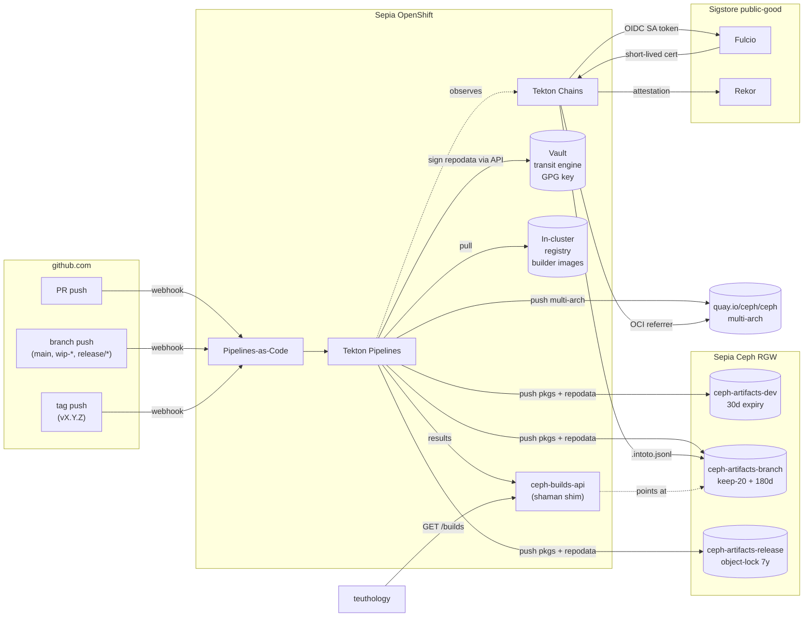
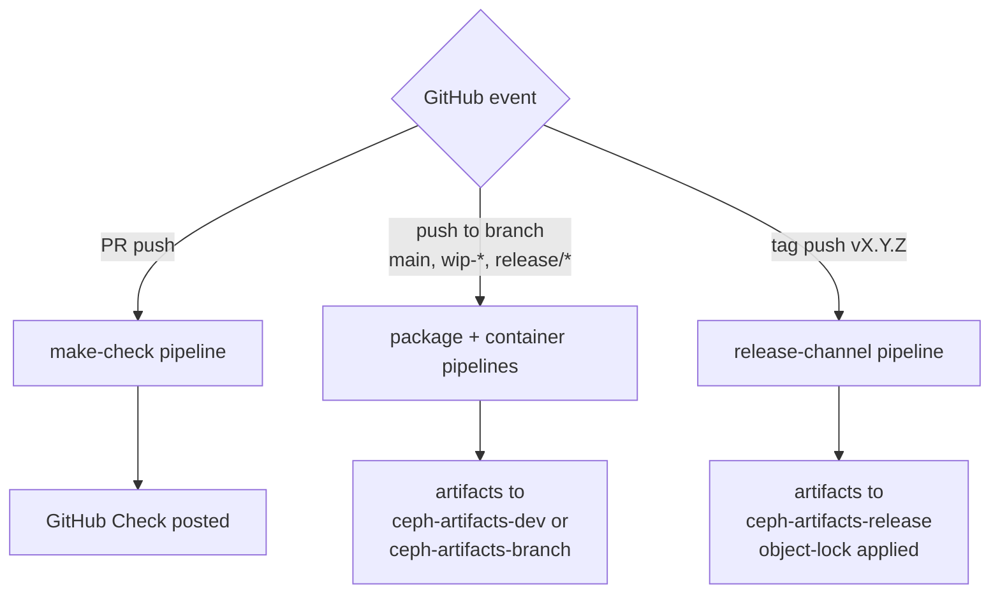
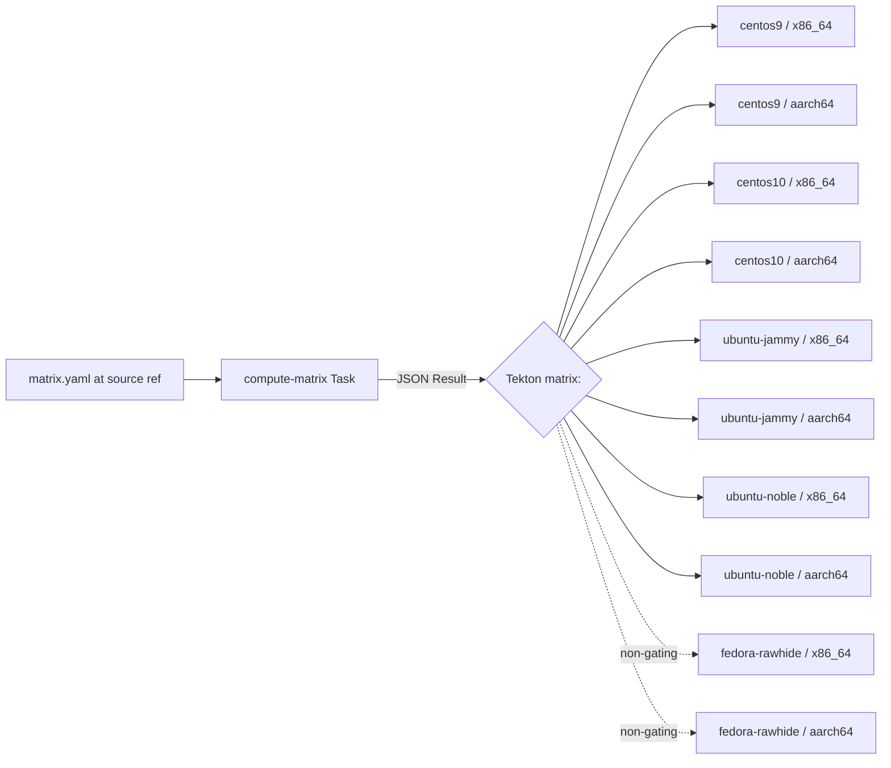
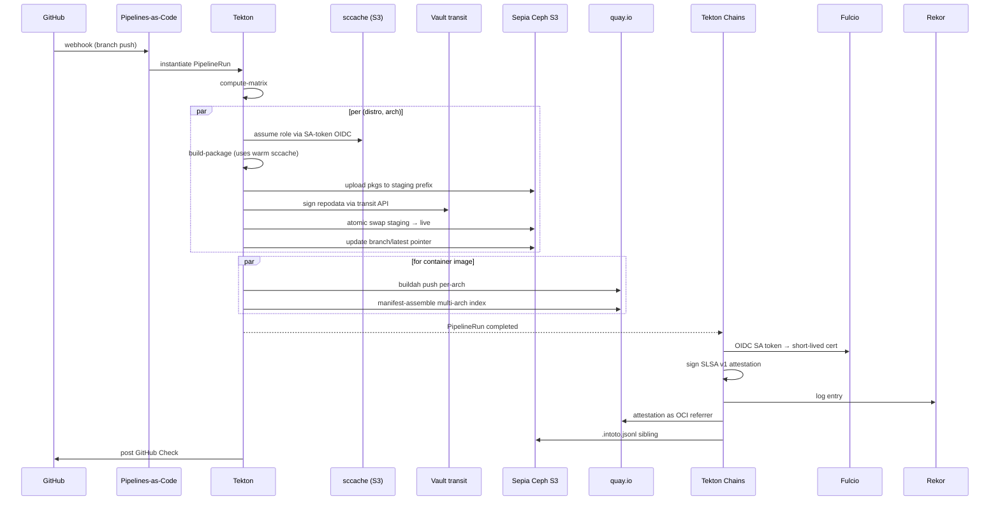
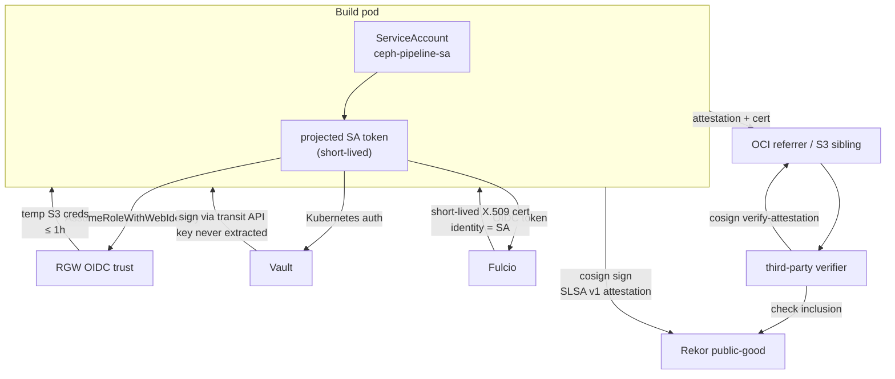
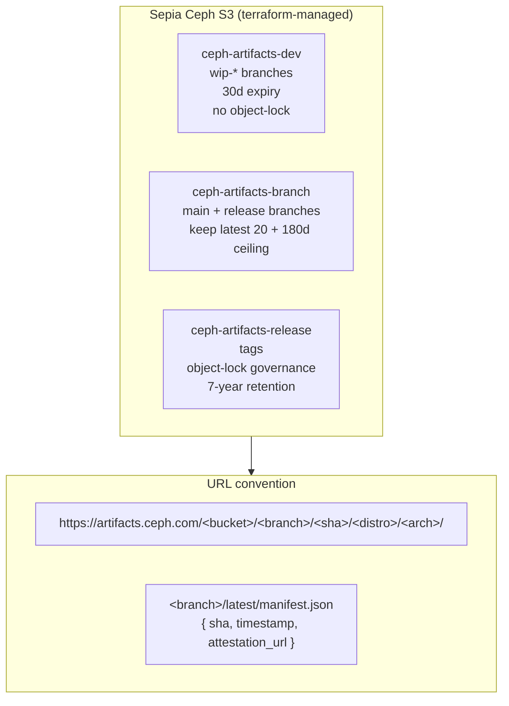
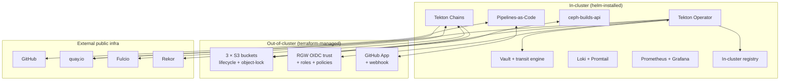
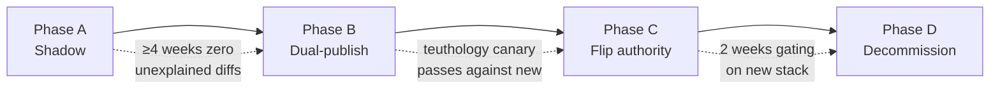

<p align="center">
  
</p>

A Tekton-based replacement for the Ceph upstream build infrastructure
(`jenkins` + `chacra` + `shaman`), with SLSA provenance via Tekton Chains.

- **Phase 1 plan:** [`PLAN.md`](PLAN.md)
- **Backlog:** [GitHub Issues](https://github.com/mmgaggle/ceph-tekton/issues)

## Goals

- **Replace** jenkins (build executor), chacra (artifact server), and shaman
  (metadata/UI/lookup API) for the `ceph/ceph` repo.
- **Provenance** for every package and container — SLSA v1.0 attestations,
  Sigstore keyless signing (Fulcio + workload OIDC), Rekor transparency log.
- **Portable** — the same Tekton manifests run on Sepia OpenShift *and* on a
  contributor's local k3s/kind cluster.
- **Parity from day one** with the existing trigger model, build matrix, and
  teuthology consumption pattern.

---

## Architecture overview



---

## Trigger model (shaman parity)



PRs from **forks** only run make check — they do not trigger package builds.
Devs who need teuthology-installable packages push a `wip-*` branch to
`ceph/ceph` directly, mirroring today's convention for org members.

---

## Build matrix



Matrix is **branch-versioned** — reef's `matrix.yaml` differs from main's, so
older release branches keep building the OS targets they shipped on.

---

## Build pipeline (per matrix cell)



---

## Provenance & trust model



**Trust properties**

- No long-lived signing key — identity-bound provenance (`built by SA X in
  namespace Y at <time>`).
- GPG repo-signing key **never leaves Vault** — even a compromised publish
  pod cannot exfiltrate it.
- S3 access via short-lived STS creds — no long-lived S3 keys anywhere.
- Anyone, anywhere, can verify a Ceph build's provenance using only public
  Sigstore infrastructure and cosign.

---

## Artifact storage



---

## Component map



---

## Repo layout

```
ceph-tekton/
├── Makefile                    # deploy / test / rollback targets
├── README.md                   # this file
├── PLAN.md                     # phase-1 design + cutover plan
├── tasks/                      # reusable Tekton Tasks (PaC-resolved)
│   ├── compute-matrix/
│   ├── build-package/
│   ├── publish-repo/
│   ├── build-container/
│   ├── manifest-assemble/
│   └── make-check/
├── pipelines/                  # PaC pipeline files (phase 1 location)
│   ├── pull-request.yaml
│   ├── branch-push.yaml
│   └── tag-push.yaml
├── images/
│   └── builders/               # ceph-builder:<distro>-<arch>
├── charts/
│   ├── ceph-tekton-stack/      # umbrella: tekton, pac, chains, vault
│   └── ceph-builds-api/
├── kustomize/
│   ├── base/
│   └── overlays/
│       ├── sepia/
│       ├── dev-local/
│       └── dev-kind/
├── terraform/
│   ├── modules/
│   │   ├── s3-buckets/
│   │   ├── rgw-oidc/
│   │   ├── rgw-roles/
│   │   └── github-app/
│   └── environments/
│       ├── sepia/
│       └── dev/
├── services/
│   └── ceph-builds-api/        # Go service
├── hack/
│   ├── shadow-diff.sh          # jenkins vs new-stack parity check
│   └── verify-build.sh         # SLSA verification
└── docs/
    ├── architecture.md
    ├── contributing-locally.md
    ├── runbook.md
    ├── provenance.md
    └── observability.md
```

---

## Cutover plan



See [`PLAN.md`](PLAN.md) for phase exit criteria and the per-component
cutover order.

---

## Getting started

> **Status:** scaffolding underway. See the [issue backlog](https://github.com/mmgaggle/ceph-tekton/issues)
> for what's grabbable.

Once issue #1 ("Hello-world Tekton on local k3s/kind") lands:

```sh
# Bootstrap a local dev cluster
make dev-up

# Point your fork's PaC at the local cluster
# (see docs/contributing-locally.md)

# Iterate on a Task
tkn task start make-check ...
```

For Sepia operators, see `docs/runbook.md` once #37 lands.

---

## Phase 2 (deferred)

- Helm-based operator with a `CephCIPlatform` CRD (operator-sdk helm mode)
- Crossplane providers for out-of-cluster state
- Argo CD reconciliation (helm charts kept Argo-ready)
- External Secrets Operator sync of long-lived secrets
- Move PaC files from `ceph-tekton/pipelines/` to `ceph/ceph/.tekton/` so
  CI changes flow through code review alongside the code that needs them
- Adjacent jenkins jobs: ceph-csi, dashboard, docs, teuthology infra
- Make check sharding (per-component or by ctest label)
