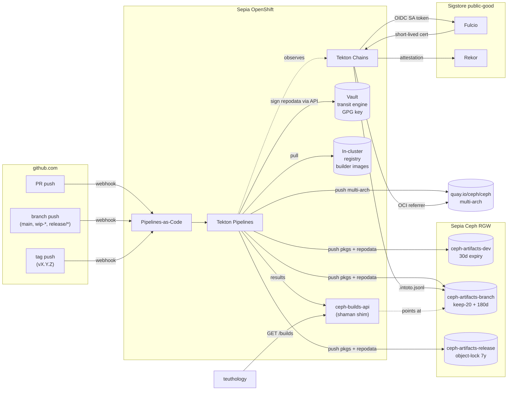

<p align="center">
  
</p>

A Tekton-based replacement for the Ceph upstream build infrastructure
(`jenkins` + `chacra` + `shaman`), with SLSA provenance via Tekton Chains.

- **Phase 1 plan:** [`PLAN.md`](PLAN.md)
- **Backlog:** [GitHub Issues](https://github.com/mmgaggle/ceph-tekton/issues)

## Goals

- **Replace** jenkins (build executor), chacra (artifact server), and shaman
  (metadata/UI/lookup API) for the `ceph/ceph` repo.
- **Provenance** for every package and container — SLSA v1.0 attestations,
  Sigstore keyless signing (Fulcio + workload OIDC), Rekor transparency log.
- **Portable** — the same Tekton manifests run on Sepia OpenShift *and* on a
  contributor's local k3s/kind cluster.
- **Parity from day one** with the existing trigger model, build matrix, and
  teuthology consumption pattern.

---

## Supply-chain compliance posture

The provenance pipeline (SLSA v1.0 attestations + Sigstore Fulcio
keyless signing + public Rekor transparency log + Vault-resident
repodata signing) is a foundation that helps satisfy a number of
software-supply-chain regimes increasingly being asked of upstream
projects and downstream consumers. What ceph-tekton *contributes*
toward each — overclaim warning: signing is necessary, not sufficient,
for any of these. Compliance also depends on the consumer's process,
SBOM coverage, vulnerability handling, and policy enforcement.

| Regime | What this satisfies | What still needs work |
|---|---|---|
| **[SLSA Build L3](https://slsa.dev/spec/v1.0/levels)** | Build platform (Tekton + Chains) generates provenance the producer cannot tamper with; signed by an independent identity (Fulcio); transparency-logged (Rekor); reproducible-build verification harness shipped (#48). Hardened build environment tracked in #38 / #39. | Driving diffoscope output toward empty on real ceph builds (#53, practically blocks on #10 builder image). Per-Task RBAC + NetworkPolicy hardening (#38, #39). |
| **[NIST SP 800-218 SSDF](https://csrc.nist.gov/Projects/ssdf)** | PS.1.1 (protect from tampering: RBAC, Vault transit, STS). PS.3.1 (verifiable provenance: SLSA + cosign verify). PW.4.1 (secured dev environment). PO.5.1 (archive + protect each release: object-lock release bucket). SBOM files produced by syft for containers (#46) and packages (#50). | RV.1.3 vuln analysis — Grype scanning Task in flight (#51); severity gating #52 HITL. PW.4.4 verify-third-party-components (#49 HITL — depends on upstream signing coverage). PW.7 continuous verification — e2e tests in CI (#54) in flight. |
| **US EO 14028 + OMB [M-22-18](https://www.whitehouse.gov/wp-content/uploads/2022/09/M-22-18.pdf) / [M-23-16](https://www.whitehouse.gov/wp-content/uploads/2023/06/M-23-16-Update-to-M-22-18.pdf)** | Producer side: SLSA-aligned attestations + signed releases give federal procurement consumers (national labs, USGS, anyone running Ceph in fed contexts) what their SSDF self-attestation forms ask for. CycloneDX SBOMs produced per package (#50), SPDX SBOMs per container (#46). | Fully-typed SBOM **attachment** to the attestation (mediaType + OCI referrer). Today: SBOM URI + content digest land as `*ARTIFACT_OUTPUTS` byproducts at `predicate.runDetails.byproducts[]`; mediaType is conveyed by URI suffix, not in the attestation. Canonical `cosign attach sbom` rewrite tracked in #55. |
| **[EU Cyber Resilience Act](https://eur-lex.europa.eu/eli/reg/2024/2847/oj) (CRA)** | Annex I §1.2(f) integrity protection (signed artifacts), (h) tamper-evidence (Rekor), Article 13 documentation (provenance is third-party-verifiable). | Article 11 coordinated vulnerability disclosure (repo-governance, out of scope for ceph-tekton). Annex II §2 vulnerability handling: scanning side lands with #51, response/disclosure process is upstream's. |
| **[CIS Software Supply Chain Security](https://www.cisecurity.org/insights/white-papers/cis-software-supply-chain-security-guide) Benchmark** | §2 build pipeline hardening (RBAC + NetworkPolicy in flight: #38, #39). §4.2 artifact signing — Chains + cosign + Rekor (#4). §4.3 attestation of build steps — slsa/v2alpha4 with deep-inspection (#46). **§4.4 signature verification at deploy — Kyverno ClusterPolicy rejecting unsigned `quay.io/ceph/*` images, shipped (#47).** | §3 dependency management — SBOM file production shipped; scanning + dep-graph attestation tracked in #51 + #55. |
| **[OpenSSF Scorecard](https://github.com/ossf/scorecard) signed-releases** | "Signed-Releases" check passes when tags publish SLSA attestations + cosign signatures (we do). | Other Scorecard checks (Branch-Protection, Code-Review, Pinned-Dependencies) are orthogonal repo-governance items. |

Each "shipped" claim above is meant to be testable end-to-end against a
real cluster via the e2e CI in [#54](https://github.com/mmgaggle/ceph-tekton/issues/54)
(in flight). Without that gate, this table drifts from reality — which
is exactly how the SBOM-attachment hallucination in
[#55](https://github.com/mmgaggle/ceph-tekton/issues/55) shipped. Treat
any unverified-in-CI claim with appropriate skepticism until #54 is
merged and gates further changes.

The phase-2 items still in flight or queued — Grype vuln scanning (#51),
severity gating (#52 HITL), upstream-dep signature verification (#49
HITL), per-Task RBAC + NetworkPolicy (#38, #39), canonical SBOM
attachment via `cosign attach sbom` (#55), e2e CI itself (#54),
reproducibility iteration (#53) — all layer onto the same Chains +
Rekor + cosign foundation without disturbing the phase-1 surface.

---

## Artifact lifecycle and retention

Built artifacts live in three RGW S3 buckets, each with policy tuned to
its consumer's needs and to the compliance properties named above. The
buckets are terraform-managed (see [`terraform/modules/s3-buckets/`](terraform/modules/s3-buckets/));
the choice of three buckets — rather than one bucket with prefix-scoped
lifecycle — is deliberate because **object-lock is a bucket-level S3
property** and can't be tightened per prefix.

| Bucket | Holds | Lifecycle | Object-lock | Public read |
|---|---|---|---|---|
| `ceph-artifacts-dev` | `wip-*` branch builds, fork-PR builds | 30-day object expiry | none | yes (mirror) |
| `ceph-artifacts-branch` | `main` + release-branch builds | keep latest 20 per `(branch, distro, arch)` + 180-day hard ceiling | none, versioning enabled | yes (mirror) |
| `ceph-artifacts-release` | tag builds (`vX.Y.Z`) | none — kept indefinitely under object-lock | **GOVERNANCE, 7-year retention** | yes (mirror) |

### Why each tier looks the way it does

**Dev bucket — recycled aggressively.** Every `wip-*` push and fork-PR
build lands here. 30 days is long enough for the longest interactive
review cycle but short enough that abandoned wip-* branches reap
automatically. No versioning, no object-lock — these artifacts are
disposable by design.

**Branch bucket — keep what teuthology cares about, then prune.** Active
release branches need history (last good build per matrix cell, plus a
few previous for bisection), but unbounded retention turns the bucket
into landfill. The "keep latest N per `(branch, distro, arch)`" rule
isn't an S3 lifecycle primitive — it's enforced by the publish-repo
task with a 7-day noncurrent-version-expiration safety net. The
180-day ceiling is the catch-all.

**Release bucket — auditable evidence we shipped this bit.** Object-lock
in GOVERNANCE mode + 7-year retention means a release artifact cannot
be overwritten or deleted within the retention window, even by the
bucket owner — only by an explicit `s3:BypassGovernanceRetention`
privilege held by an audited break-glass role. This is what gives Ceph
the SOX/HIPAA-style "show me the bit-identical artifact you said you
shipped on day X" property compliance frameworks ask for. **Reads stay
public** so consumers can still `dnf install ceph-X.Y.Z` years later;
**writes are immutable**.

### Mirror semantics

All three buckets grant `s3:GetObject` (and `s3:GetObjectVersion`) to
`Principal: "*"` via bucket policy — no anonymous listing, just object
fetches by key. This is exactly what `download.ceph.com` /
`chacra.ceph.com` do today. The URL convention is the discovery
mechanism, mirroring chacra's pattern:

```
https://artifacts.ceph.com/<bucket>/<branch>/<sha>/<distro>/<arch>/
                                                  └─ <pkgs+repodata+sboms+attestations>
```

The `<branch>/latest/manifest.json` pointer is updated atomically per
successful publish, so consumers can pin to either a specific sha
(immutable, reproducible) or the moving branch tip (auto-updating).

Object-lock on the release bucket is **orthogonal to public read** —
release artifacts are simultaneously world-readable AND undeletable
until retention expires.

See [`docs/architecture.md`](docs/architecture.md) §"Artifact storage"
for the full diagram and the rejected alternatives in the Decision Log.

---

## Architecture overview

GitHub events (PR, branch push, tag) are turned into PipelineRuns by
Pipelines-as-Code. Tekton fans out a per-`(distro, arch)` matrix of
build + publish tasks, pushes packages and repodata to lifecycle-tiered
RGW S3 buckets, and pushes multi-arch container images to
`quay.io/ceph/ceph`. Tekton Chains observes every completed
PipelineRun, mints a short-lived Sigstore identity from the workload's
projected ServiceAccount token, and logs a SLSA v1 attestation to Rekor
alongside the artifact.

A small `ceph-builds-api` service reads Tekton Results and serves the
shaman-compatible lookup API that teuthology already speaks, so the
cutover from jenkins/chacra/shaman needs zero teuthology change on
day one.



The full architectural reference — trigger model, build matrix, build
pipeline sequence, provenance + trust model, artifact storage, component
map, cutover plan, and the design Decision Log — lives in
[`docs/architecture.md`](docs/architecture.md).

---

## Repo layout

```
ceph-tekton/
├── Makefile                    # deploy / test / rollback targets
├── README.md                   # this file
├── PLAN.md                     # phase-1 design + cutover plan
├── tasks/                      # reusable Tekton Tasks (PaC-resolved)
│   ├── compute-matrix/
│   ├── build-package/
│   ├── publish-repo/
│   ├── build-container/
│   ├── manifest-assemble/
│   └── make-check/
├── pipelines/                  # PaC pipeline files (phase 1 location)
│   ├── pull-request.yaml
│   ├── branch-push.yaml
│   └── tag-push.yaml
├── images/
│   └── builders/               # ceph-builder:<distro>-<arch>
├── charts/
│   ├── ceph-tekton-stack/      # umbrella: tekton, pac, chains, vault
│   └── ceph-builds-api/
├── kustomize/
│   ├── base/
│   └── overlays/
│       ├── sepia/
│       ├── dev-local/
│       └── dev-kind/
├── terraform/
│   ├── modules/
│   │   ├── s3-buckets/
│   │   ├── rgw-oidc/
│   │   ├── rgw-roles/
│   │   └── github-app/
│   └── environments/
│       ├── sepia/
│       └── dev/
├── services/
│   └── ceph-builds-api/        # Go service
├── hack/
│   ├── shadow-diff.sh          # jenkins vs new-stack parity check
│   └── verify-build.sh         # SLSA verification
└── docs/
    ├── architecture.md
    ├── contributing-locally.md
    ├── runbook.md
    ├── provenance.md
    └── observability.md
```

---

## Getting started

> **Status:** scaffolding underway. See the [issue backlog](https://github.com/mmgaggle/ceph-tekton/issues)
> for what's grabbable.

Spin up a local kind cluster + Tekton Pipelines and run the smoke-test
pipeline:

```sh
make dev-up        # create kind cluster, install Tekton Pipelines
make dev-test      # apply + run the hello-world pipeline, stream logs
make dev-down      # tear it all down
```

Each additional component (Pipelines-as-Code, Tekton Chains, Vault,
Kyverno, the reproducibility-check harness) layers onto that baseline
via its own `make dev-*-up` target — bring up only what you're iterating
on. The contribution flow (fork → branch → smoke-test → PR), prereqs,
per-component dev loops, a troubleshooting matrix, and a one-screen
cheat sheet of every `make` target and smoke pipeline all live in
[`docs/contributing-locally.md`](docs/contributing-locally.md).

For Sepia operators, see `docs/runbook.md` once #37 lands.

---

## Phase 2 (deferred)

- Helm-based operator with a `CephCIPlatform` CRD (operator-sdk helm mode)
- Crossplane providers for out-of-cluster state
- Argo CD reconciliation (helm charts kept Argo-ready)
- External Secrets Operator sync of long-lived secrets
- Move PaC files from `ceph-tekton/pipelines/` to `ceph/ceph/.tekton/` so
  CI changes flow through code review alongside the code that needs them
- Adjacent jenkins jobs: ceph-csi, dashboard, docs, teuthology infra
- Make check sharding (per-component or by ctest label)
