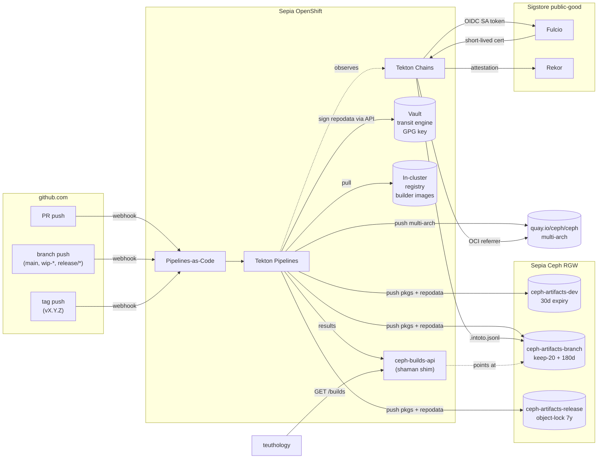
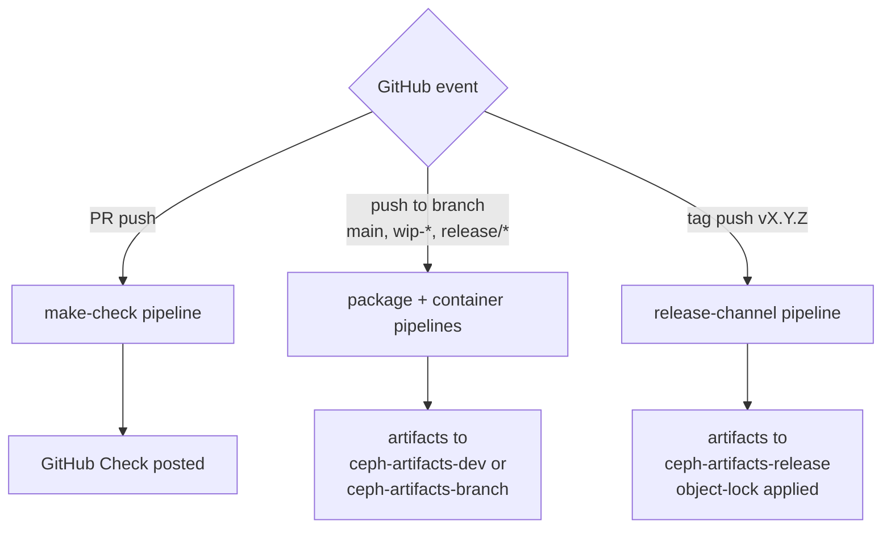
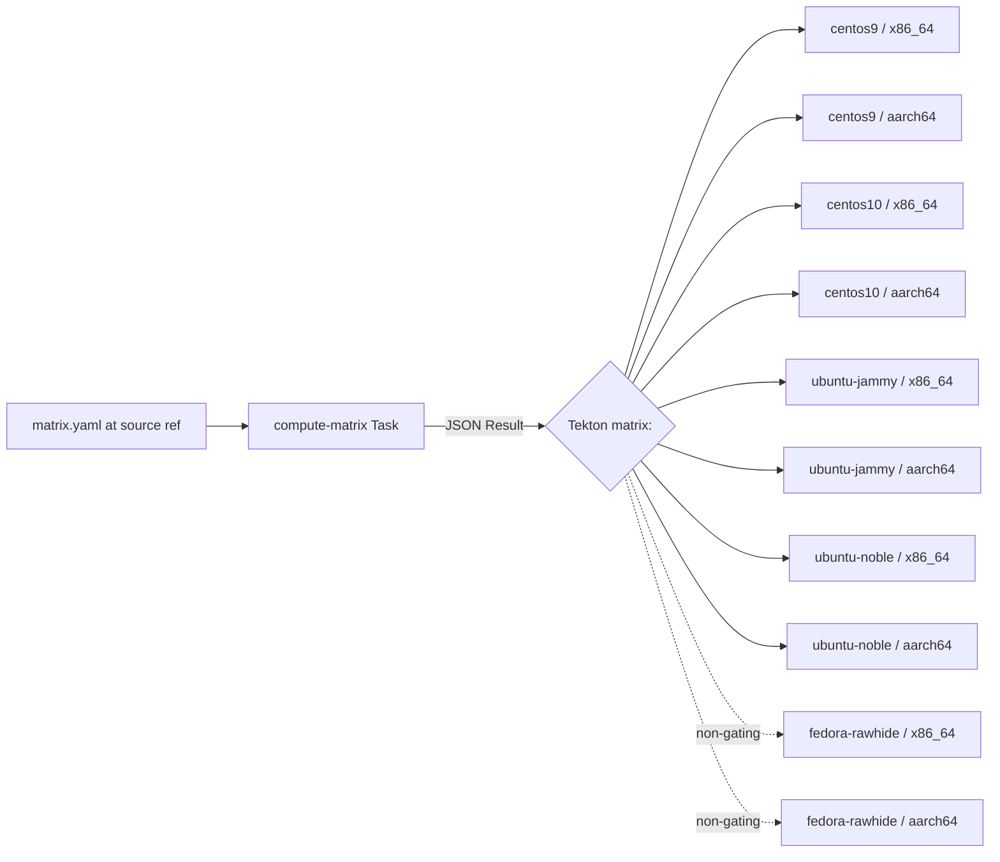
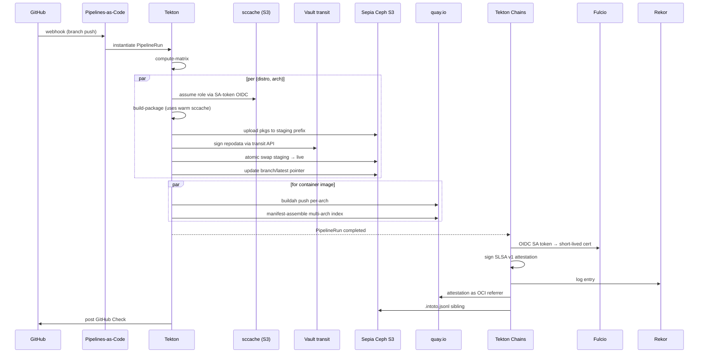
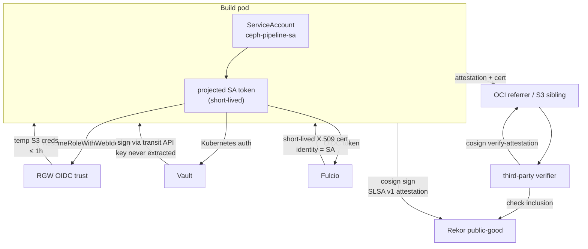
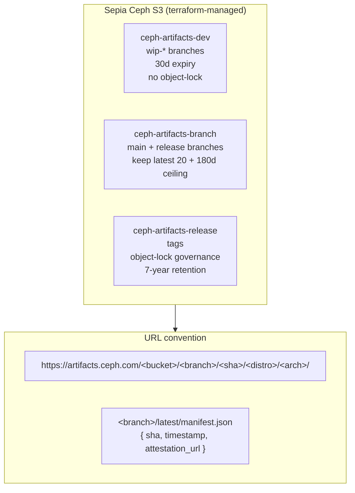
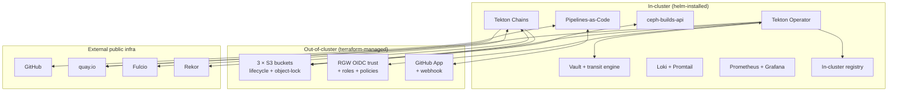
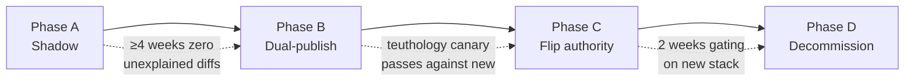

# Architecture reference

The durable architectural reference for `ceph-tekton` — diagrams, prose,
and the decision log that captures *why* the stack looks the way it
does.

For the higher-level pitch and "where do I start" pointers, see the
[`README`](../README.md). For the phase-1 design + delivery plan that
generated this architecture, see [`PLAN.md`](../PLAN.md). This document
should age slowly — the design pass that produced it is captured in the
Decision Log section at the bottom.

---

## Architecture overview

GitHub events (PR, branch push, tag) are turned into PipelineRuns by
Pipelines-as-Code. Tekton fans out a per-`(distro, arch)` matrix of
build + publish tasks that pull from an in-cluster builder-image
registry, push packages and repodata to lifecycle-tiered RGW S3 buckets,
and push multi-arch container images to `quay.io/ceph/ceph`. Tekton
Chains observes every completed PipelineRun, mints a short-lived
Sigstore identity from the workload's projected SA token, signs an
in-toto SLSA v1 attestation, logs it to Rekor, and stores it alongside
the artifact (OCI referrer for containers, `.intoto.jsonl` sibling for
packages). A small `ceph-builds-api` service reads Tekton Results and
serves the shaman-compatible lookup API that teuthology already speaks.

---

## Trigger model (shaman parity)

PRs from **forks** only run make check — they do not trigger package
builds. Devs who need teuthology-installable packages push a `wip-*`
branch to `ceph/ceph` directly, mirroring today's convention for org
members. Tag pushes route to the release-channel pipeline so that
object-lock and 7-year retention apply automatically.

| Event | Pipeline | Bucket |
| --- | --- | --- |
| PR push (fork or org) | `make check` matrix (gating) | n/a |
| Push to `main`, release branch, or `wip-*` | Full package matrix + container build | `ceph-artifacts-branch` or `ceph-artifacts-dev` |
| Tag (`vX.Y.Z`) | Release-channel package + container build | `ceph-artifacts-release` |

---

## Build matrix

The matrix is **branch-versioned** — reef's `matrix.yaml` differs from
main's, so older release branches keep building the OS targets they
shipped on. A `compute-matrix` Task reads `matrix.yaml` at the source
ref and emits a JSON array as a Tekton Result; downstream `build` and
`publish` tasks fan out via Tekton's native `matrix:` field. Both
arches are built on **native arch worker nodes** — no qemu — to keep
build times survivable. Fedora rawhide is informational only.

---

## Build pipeline (per matrix cell)

Each matrix cell runs `dpkg-buildpackage` (DEB) or `rpmbuild` (RPM)
directly inside a pre-baked builder image — no mock/pbuilder layer.
ccache is provided by **sccache with an S3 backend**, namespaced per
`(branch, distro, arch)`; branch builds fill the cache and wip-*/PR
builds reuse it. After build, a dedicated `publish-repo` task uploads
packages to a staging prefix, runs `createrepo_c` (RPM) or `reprepro`
(DEB) in a distro-native container, calls Vault's transit API to sign
repodata, then **atomically swaps staging→live** in S3 before updating
the `<branch>/latest` pointer. Container images are built per-arch with
**buildah** on native arch workers; a final `manifest-assemble` task
publishes the multi-arch index to `quay.io/ceph/ceph` so existing
`podman pull` URLs keep working.

---

## Provenance & trust model

**Trust properties**

- No long-lived signing key — identity-bound provenance (`built by SA X
  in namespace Y at <time>`).
- GPG repo-signing key **never leaves Vault** — even a compromised
  publish pod cannot exfiltrate it.
- S3 access via short-lived STS creds — no long-lived S3 keys anywhere.
- Anyone, anywhere, can verify a Ceph build's provenance using only
  public Sigstore infrastructure and cosign.

The projected ServiceAccount token is the single root of trust for the
build pod. It exchanges for short-lived S3 creds via RGW's OIDC trust,
authenticates to Vault for transit-API GPG signing, and is presented to
Fulcio in exchange for a short-lived X.509 cert bound to the SA
identity. The cosign signature + SLSA v1 attestation are logged to the
Sigstore public-good Rekor instance and stored alongside the artifact
(OCI referrer for container images, `.intoto.jsonl` sibling object for
package builds). Attestation format is **SLSA Provenance v1.0**
(in-toto). The dev k3s/kind overlay swaps Fulcio for an in-cluster
cosign key so contributors can iterate without depending on
public-good infra.

---

## Artifact storage

Three buckets divide artifacts by lifecycle class so that wip-branch
churn never threatens the release archive:

- **`ceph-artifacts-dev`** — wip-* branches, 30-day expiry, no
  object-lock.
- **`ceph-artifacts-branch`** — `main` + release branches, keep the
  latest 20 per `(branch, distro, arch)` with a 180-day ceiling.
- **`ceph-artifacts-release`** — tags, **object-lock governance mode**,
  7-year retention.

URLs follow
`https://artifacts.ceph.com/<bucket>/<branch>/<sha>/<distro>/<arch>/`,
and each successful build atomically updates
`<branch>/latest/manifest.json` with the new sha, timestamp, and a
pointer to its provenance attestation.

---

## Component map

Three concentric rings of ownership:

- **In-cluster**, helm-installed: Tekton Operator, Pipelines-as-Code,
  Chains, Vault (with transit engine), Loki/Promtail and
  Prometheus/Grafana for observability, an in-cluster registry for
  builder images, and the `ceph-builds-api` shim.
- **Out-of-cluster**, terraform-managed: the three S3 buckets and their
  lifecycle/object-lock policies, the RGW OIDC trust + roles +
  policies, and the GitHub App and its webhook.
- **External public infra** consumed as-a-service: GitHub, quay.io,
  Fulcio, Rekor.

The split matters operationally: any in-cluster component can be
reinstalled by re-running `helm upgrade`; any out-of-cluster resource
needs `terraform apply` (or a manual ticket against Sepia infra).

### Make check execution

A single fat pod per `(distro, arch)` — ~32 CPU / 64 GB RAM — runs
`run-make-check.sh` with `ctest -j$(nproc)`. With a warm sccache the
total wall time lands at ~25–40 min; cold runs add the build time.
x86_64 is gating; aarch64 runs in parallel and is informational
initially. Sharding by component or ctest label is deferred to phase 2
and is only worth doing if single-pod p95 becomes a pain point.

---

## Cutover plan

| Phase | What | Exit criteria |
| --- | --- | --- |
| **A. Shadow** | New stack builds in parallel; jenkins authoritative; `hack/shadow-diff.sh` compares rpm/deb outputs | ≥4 weeks of zero unexplained diffs across the matrix |
| **B. Dual-publish** | New stack also publishes via shaman URL conventions (or shaman publishes pointers to new S3); teuthology can pull from either | Teuthology canary jobs pass against new-stack URLs |
| **C. Flip authority** | `ceph-builds-api` shim becomes authoritative shaman API; jenkins jobs disabled in order of confidence: make check → packages (start with most-built combos) → containers → release-tag pipelines | All ceph/ceph PRs and branch pushes gated by new stack for 2 weeks |
| **D. Decommission** | Old jenkins jobs deleted, chacra/shaman shut down, DNS pointed to new endpoints | jenkins.ceph.com, chacra.ceph.com, shaman.ceph.com decommissioned |

Total expected duration ~3–6 months. See [`PLAN.md`](../PLAN.md) for
the per-component cutover order within each phase.

---

## Decision Log

Each entry captures one major architecture choice, the alternatives
that were considered and rejected, and the reason in 3–5 lines. These
are durable: if a decision is revisited, append a new entry rather than
rewriting the old one.

### Platform: OpenShift on Sepia (not vanilla k8s)

- **Decision:** Run Tekton on **OpenShift in Sepia**, co-located with
  the Ceph cluster providing S3.
- **Rejected alternatives:** Vanilla Kubernetes in Sepia; a managed
  k8s offering; cloud-hosted Tekton.
- **Reason:** Sepia already runs OpenShift, the ops team already
  supports it, and OpenShift Pipelines ships Tekton + PaC + Chains as
  a supported bundle. Co-location with RGW removes egress and latency
  cost for the artifact path.

### Portability: kustomize overlays, no OpenShift-only CRDs in base

- **Decision:** Keep `kustomize/base/` portable; OpenShift-specific
  bits live in `overlays/sepia/`. The same manifests deploy on k3s/kind
  via `overlays/dev-local/` and `overlays/dev-kind/`.
- **Rejected alternatives:** Target OpenShift-only and lean on
  `oc`/Route/SCC primitives in the base manifests; ship two parallel
  manifest trees.
- **Reason:** Contributors must be able to iterate locally without
  Sepia access. A portable base is the cheapest insurance against
  lock-in if the platform choice ever changes.

### Artifact storage: S3 on Sepia Ceph RGW with three lifecycle-tiered buckets

- **Decision:** Three terraform-managed RGW S3 buckets —
  `ceph-artifacts-dev` (30d), `ceph-artifacts-branch` (keep-20 + 180d),
  `ceph-artifacts-release` (object-lock, 7y).
- **Rejected alternatives:** One bucket with prefix-based lifecycle; a
  filesystem-backed artifact store (chacra-style); cloud object
  storage outside Sepia.
- **Reason:** Per-bucket lifecycle and object-lock policies are simpler
  to reason about and audit than per-prefix rules. Eating our own
  dogfood (RGW) keeps the artifact path inside Sepia. Object-lock on
  releases is non-negotiable for supply-chain integrity.

### S3 credentials: STS OIDC via SA-token (no long-lived keys)

- **Decision:** Register the OpenShift SA token issuer as an OIDC
  provider on RGW. Build pods call `AssumeRoleWithWebIdentity` with
  their projected SA token to get S3 creds with TTL ≤ 1h.
- **Rejected alternatives:** Long-lived IAM-style access keys in k8s
  Secrets; per-namespace shared keys; ESO-synced rotating keys.
- **Reason:** A leaked SA token is bounded by k8s issuer rotation and
  RGW role policy; a leaked long-lived key is not. Identity-bound STS
  creds are also what makes the provenance story coherent end-to-end.

### Signing identity: Fulcio keyless for Sepia, cosign keys for dev

- **Decision:** Sepia uses **Fulcio keyless** signing via per-PipelineRun
  SA OIDC → short-lived cert → cosign → Rekor public-good. The dev
  k3s/kind overlay swaps Fulcio for an in-cluster cosign key.
- **Rejected alternatives:** Long-lived cosign signing key managed by
  ESO/Vault for everything; private Sigstore deployment.
- **Reason:** Keyless eliminates the rotation burden and gives third
  parties identity-bound provenance ("built by SA X in namespace Y").
  Public-good Sigstore is unreachable or undesirable from disconnected
  contributor envs, so dev gets a static key — strictly **never**
  trusted by release verifiers.

### Trigger model: shaman parity from day one

- **Decision:** PR push → `make check` only; push to `main` /
  release / `wip-*` branches → full package + container matrix; tag
  push → release-channel pipeline targeting the object-lock bucket.
  PRs from forks do **not** trigger package builds.
- **Rejected alternatives:** Build packages on every PR (current
  jenkins behaviour for org members, applied uniformly); only build
  on merge.
- **Reason:** Matches what teuthology and the dev workflow already
  expect — devs push `wip-*` for installable packages. Building
  packages on fork PRs gives drive-by contributors free access to
  signed-by-our-infra artifacts.

### Build mechanics: pre-baked builder images, not install-deps per build

- **Decision:** A dedicated `builder-images` pipeline rebuilds
  `ceph-builder:<distro>-<arch>` nightly and on `install-deps.sh`
  changes, pushed to the in-cluster registry. Build tasks run
  `dpkg-buildpackage`/`rpmbuild` directly inside the builder image.
- **Rejected alternatives:** Run `install-deps.sh` in every build pod;
  use upstream `mock`/`pbuilder` chroots; rely on quay.io for builder
  images.
- **Reason:** Per-build dep-install adds 5–15 min and a network failure
  surface to every PipelineRun. mock/pbuilder add an extra isolation
  layer Tekton already provides. In-cluster registry pulls are fast and
  free of egress quota.

### Build cache: sccache on S3 (not a PVC)

- **Decision:** **sccache with an S3 backend**, namespaced per
  `(branch, distro, arch)`. Branch builds fill the cache; wip-*/PR
  builds reuse it.
- **Rejected alternatives:** Shared RWX PVC mounted into every build
  pod; native ccache with NFS; no cache.
- **Reason:** A shared PVC is a single-writer hotspot and an
  HA/upgrade headache on OpenShift. sccache S3 is multi-writer-safe,
  rides the existing RGW path, and benefits from the same STS creds
  flow. Native ccache S3 has worse Tekton ergonomics.

### Container images: buildah per-arch on native nodes (no qemu)

- **Decision:** Two parallel `buildah` tasks
  (`build-image-x86_64`, `build-image-aarch64`) on native arch worker
  nodes; a final `manifest-assemble` task pushes the multi-arch index
  to `quay.io/ceph/ceph`.
- **Rejected alternatives:** Cross-build under qemu on a single arch;
  use `docker buildx` with QEMU emulation; build on a hosted
  multi-arch runner.
- **Reason:** qemu adds ~10× slowdown for a C++ build — unacceptable.
  Sepia already has aarch64 nodes; using them is free. `quay.io/ceph/ceph`
  keeps existing `podman pull` URLs working unchanged.

### Container registries: in-cluster for builders, quay.io for daemons

- **Decision:** Builder images live in an **in-cluster registry**;
  published daemon images go to **quay.io/ceph/ceph**.
- **Rejected alternatives:** Push builder images to quay.io too; run
  everything from one registry; self-host a public-facing registry.
- **Reason:** Builder images are high-pull-volume, internal-only, and
  carry no creds-leak risk if kept in-cluster. quay.io is the
  established home for published Ceph daemon images and provides OCI
  referrer support for Chains attestations for free.

### Repodata signing: Vault transit engine (not a k8s Secret GPG key)

- **Decision:** The GPG repo-signing key lives in **Vault's transit
  engine** and **never leaves Vault**. The `publish-repo` task calls
  Vault's sign API.
- **Rejected alternatives:** Mount the GPG private key into the
  publish pod as a k8s Secret; use ESO to sync the key from Vault into
  a Secret; sign offline.
- **Reason:** Defense in depth — a compromised publish pod cannot
  exfiltrate the key; it can only request signatures while its
  short-lived token is valid. Vault audit logs every signing call,
  giving a complete trail.

### GitHub integration: Pipelines-as-Code (not Tekton Triggers)

- **Decision:** Use **Pipelines-as-Code** with a GitHub App.
- **Rejected alternatives:** Tekton Triggers + EventListener +
  Interceptors; webhook → custom controller; GitHub Actions glue.
- **Reason:** PaC ships with OpenShift Pipelines, handles GitHub App
  auth, posts rich GitHub Checks, supports `/test` and `/retest`
  comments, and is installable on vanilla k8s/k3s for dev. Tekton
  Triggers would require us to reimplement most of that.

### PaC file location: phase-1 in `ceph-tekton/`, phase-2 in `ceph/ceph/.tekton/`

- **Decision:** Phase 1 keeps PaC pipeline files in
  `ceph-tekton/pipelines/`, remote-resolved by PaC. Phase 2 moves them
  to `ceph/ceph/.tekton/` so CI changes flow through code review
  alongside the code that needs them.
- **Rejected alternatives:** Put them in `ceph/ceph/.tekton/` on day
  one; keep them in `ceph-tekton/` permanently.
- **Reason:** We need to iterate on the pipelines fast during
  bootstrap without dragging `ceph/ceph` review cycles into every
  change. Once the surface stabilises, code-adjacent PaC files are the
  correct end state.

### Shaman replacement: `ceph-builds-api` shim, not a teuthology change

- **Decision:** Build a small Go service `ceph-builds-api` that reads
  Tekton Results and exposes the existing shaman API surface
  (`GET /builds?branch=X&distro=Y&arch=Z`).
- **Rejected alternatives:** Change teuthology to query Tekton/Results
  directly; change teuthology to consume S3 listings; drop the lookup
  API entirely.
- **Reason:** Zero teuthology change at cutover means the migration
  risk is contained to this stack. The shim is small and disposable
  once teuthology is rewritten to a new API in phase 2.

### Phase-1 deploy: `make` + `helm` + `terraform` (no operator, no Crossplane)

- **Decision:** Phase 1 deploys via top-level `Makefile` driving
  `helm upgrade` (in-cluster) + `terraform apply` (out-of-cluster).
  No `CephCIPlatform` CRD, no Crossplane, no Argo CD reconciliation.
- **Rejected alternatives:** Build a helm-mode operator + Crossplane
  + Argo from the start.
- **Reason:** Phase 1 must converge fast. Helm charts and kustomize
  bases stay clean enough to be wrapped by an operator and reconciled
  by Argo in phase 2 without rework. Building the operator first
  delays first-package-out-the-door by months.

### Secrets handling: long-lived secrets in plain k8s Secrets, ESO deferred

- **Decision:** GitHub App private key and quay.io robot token live in
  plain k8s Secrets created by terraform. S3 access is STS, cosign is
  keyless, GPG is Vault-transit — none of those need a Secret.
- **Rejected alternatives:** Use External Secrets Operator from day
  one to sync all long-lived secrets from Vault.
- **Reason:** Only two long-lived secrets remain in phase 1, both
  rotated rarely. ESO adds another moving part to bootstrap; the
  payoff is small until the secret count grows. ESO is on the phase-2
  list.

### Repo layout: monorepo (not split)

- **Decision:** Single `ceph-tekton` repo holds Tekton tasks/pipelines,
  builder Dockerfiles, helm charts, kustomize overlays, terraform, and
  the `ceph-builds-api` service.
- **Rejected alternatives:** Split repos per concern
  (`ceph-tekton-pipelines`, `ceph-tekton-infra`,
  `ceph-tekton-charts`, `ceph-builds-api`).
- **Reason:** Cross-cutting changes (e.g. adding a new distro) touch
  pipelines + builder images + terraform + helm in one PR. Splitting
  repos turns every such change into a coordinated multi-repo dance.
  Phase 2 can extract pieces if scope justifies it.

### Observability: Loki + Prometheus in-cluster (phase 1)

- **Decision:** Loki + Promtail for logs, Prometheus + Grafana for
  metrics, all in-cluster, installed by the same umbrella helm chart.
- **Rejected alternatives:** Ship logs/metrics to an external SaaS;
  rely on OpenShift built-in monitoring only.
- **Reason:** Keeps the dev overlay self-contained (same chart works on
  k3s/kind). OpenShift monitoring is fine for platform-level health
  but doesn't cover pipeline-run-level views the way Tekton-specific
  dashboards do.
