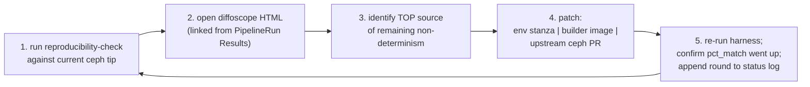

# Reproducible builds — status, methodology, and iteration log

This is the **iteration tracker** for issue
[#53](https://github.com/mmgaggle/ceph-tekton/issues/53). It is a
living document: every round we open the latest diffoscope report,
name the top non-determinism source, patch it (in ceph, in the
builder image, or in the env stanza), re-verify, and append the
round to the log at the bottom of this page.

For the design of the harness itself, see
[`reproducibility.md`](reproducibility.md). For the
cryptographic-provenance story (who signed it, when, against what
identity) see [`provenance.md`](provenance.md). This doc is purely
about the *bit-for-bit* property, not the trust story.

---

## Status snapshot

| Concern | State | Tracking |
|---|---|---|
| Reproducibility harness (Task + Pipeline + smoke target) | **Shipped** | [#48](https://github.com/mmgaggle/ceph-tekton/issues/48), commit `2812929` |
| Methodology + iteration playbook (this doc) | **Shipped** (first pass) | [#53](https://github.com/mmgaggle/ceph-tekton/issues/53) |
| Real ceph builds under the harness | **Blocked** | [#10](https://github.com/mmgaggle/ceph-tekton/issues/10) (builder image) |
| Grafana panel for `pct_match` trend | Deferred until first real-ceph data point | [#42](https://github.com/mmgaggle/ceph-tekton/issues/42) (Grafana stack) |
| Synthetic Round-1 example (proves the loop works) | **Shipped** | This doc, [`tasks/reproducibility-check/examples/timestamps/`](../tasks/reproducibility-check/examples/timestamps/) |

**One-line summary:** the iteration *loop* is operational and
demonstrated on a synthetic target; the iteration *substance* against
ceph itself starts the day [#10](https://github.com/mmgaggle/ceph-tekton/issues/10)
lands a builder image.

---

## Methodology — the iteration loop

Every round of this issue executes the same five-step cycle. The cycle
is designed to converge: each round picks the **single largest source
of remaining non-determinism**, fixes it once across the matrix, then
re-runs the harness. Fixing the largest source first means the % match
trend in Grafana goes up monotonically and visibly.



Each step expanded:

1. **Run the harness.** The Tekton Task
   [`reproducibility-check`](../tasks/reproducibility-check/task.yaml)
   builds twice with the determinism env stanza and emits
   `pct_match`, `reproducible_bytes`, `total_bytes`, plus a
   `report_url` pointing at the diffoscope HTML in S3. No manual setup
   beyond pointing the PipelineRun at the right `(source-repo,
   build-command, output-glob, builder-image)`.
2. **Open the report.** Diffoscope's HTML output is nested: it peels
   archives → packages → ELF binaries → ELF sections. The interesting
   line is usually 3–4 clicks deep. The JSON sidecar
   (`diffoscope.json`) lets you grep / jq for the largest diff hunks
   when the tree gets unwieldy.
3. **Identify the top source.** Apply the categorization table below
   to the largest diff hunk. Most findings collapse to one of the
   eight categories — that's by design, the Reproducible Builds project
   has spent a decade enumerating them.
4. **Patch.** The fix lives in one of three places:
   - **The env stanza** in
     [`tasks/reproducibility-check/task.yaml`](../tasks/reproducibility-check/task.yaml)
     (and, by copy, in the eventual `build-package` Task from #16) —
     for environment-level fixes like `LC_ALL=C` or `TZ=UTC`.
   - **The builder image** (#10) — for tool-level fixes like
     "upgrade to a gcc that honours `-ffile-prefix-map`" or "install
     `dh-strip-nondeterminism`".
   - **An upstream ceph PR** — for source-level fixes like
     "stop embedding `__DATE__` in this `.cc` file" or "make this
     codegen step stable-sort its inputs". Tag with `reproducible-builds`
     in the ceph tracker and link the diffoscope evidence.
5. **Re-verify and log.** Re-run the harness; the new `pct_match`
   should be strictly higher than the previous round. Append a row to
   the [iteration log](#iteration-log) at the bottom of this doc with
   the round number, fix applied, before/after `pct_match`, commit
   refs, and the diffoscope-HTML link. The Grafana panel
   ([#42](https://github.com/mmgaggle/ceph-tekton/issues/42)) reads
   the same Tekton Result and renders the trend.

**Stopping rule.** We stop iterating at the higher of (a) **95%
pct_match** or (b) the point where the next-largest remaining
diff hunk is upstream-blocked (e.g. needs a compiler change). Debian's
multi-year reproducible-builds program plateaus at ~96% across its
entire archive; expecting better than that on a 7M-line C++ codebase
with Python, Cython, generated protos, and JIT-compiled bytecode is
not realistic for phase 1.

---

## The eight categories of non-determinism

What we expect to find in ceph, in roughly the order Debian's tracker
reports them as causes across its archive. Each row names the
canonical Reproducible Builds project fix; the fix references are
deliberately to env-level / build-system patterns rather than ceph-
specific patches, because the fix surface is the same across every
C/C++/Python codebase.

| # | Category | What it looks like in diffoscope | Canonical fix |
|--:|---|---|---|
| 1 | **Embedded timestamps** | `__DATE__` / `__TIME__` strings in `.rodata`; `build_time` fields in package metadata; `Mtime: …` differing across most files in an archive | Export `SOURCE_DATE_EPOCH=$(git log -1 --pretty=%ct)` before the build. Already in the env stanza. For source-level `__DATE__` use `-Wno-builtin-macro-redefined -D__DATE__="..."` overrides, or delete the macro and read from env at startup. |
| 2 | **Build-path leakage in debug info** | `DW_AT_comp_dir` shows `/build/abc123/src/foo.cc` vs `/build/def456/src/foo.cc`; `__FILE__` strings in `.rodata`; `DT_RPATH` baking host paths into binaries | `-ffile-prefix-map=$PWD=.` in CFLAGS/CXXFLAGS (gcc >= 8, clang >= 10). Already in the env stanza. For RPATH, audit `cmake` invocations for `CMAKE_INSTALL_RPATH_USE_LINK_PATH=ON`. |
| 3 | **Build-host / build-user metadata** | `Build-Host:` / `Packager:` differs in package metadata; `uname -a` output captured in build logs that get shipped; `whoami` in a generated config | `dpkg-buildpackage` honours `DEB_BUILD_OPTIONS=nostrip` and `--no-buildinfo`; `rpmbuild` honours `--define '_buildhost reproducible-builder'`. Set both in the builder image entrypoint. |
| 4 | **Locale-sensitive sort order** | Filename order differs in a `.tar` / `.a` / `.deb data.tar.zst`; symbol order differs in a static archive's index; `ls` output captured in a generated header | `LC_ALL=C` in the env stanza forces byte-order sort. Already in the env stanza. For `ar`, use `D` modifier (`ARFLAGS=Dcr`) — the deterministic-archive mode. |
| 5 | **Parallel-build ordering** | Same file content but appearing at different offsets across a multi-file archive (`.a`, `.zip`); object files linked in different order producing different `.text` layouts | This is almost always an upstream bug — a Makefile that doesn't fully express its dependencies. **Do not** mask by setting `-j1`; that hides the bug for one build but doesn't fix it. File upstream with the diffoscope evidence. |
| 6 | **Hash-table iteration order** | Generated headers / serialised dicts with the same keys but in different orders run-to-run; cython-generated C with `__pyx_*` symbols in different order; protobuf-generated source with shuffled enum lists | `PYTHONHASHSEED=0` for python helpers; `GOFLAGS=-trimpath` for any Go components; for protoc/grpc-gen, set `-experimental_allow_proto3_optional` and pass a fixed seed if codegen is non-deterministic. |
| 7 | **gzip / tar / ar metadata** | gzip header timestamp differs (`Mtime: …` at offset 4); tar member uid/gid differs (`uid: 1000` vs `uid: 1001`); ar timestamps `1234567890` vs `1234567891`; xattrs / ACLs captured by tar | `tar --sort=name --owner=0 --group=0 --numeric-owner --mtime=@$SOURCE_DATE_EPOCH --no-xattrs --no-acls`; `gzip -n` (no timestamp); `ar D` modifier as above. |
| 8 | **Randomly-named temporaries / link-time identifiers** | `.note.gnu.build-id` differs but everything else matches (means inputs matched, build-id is hashed from them and a random seed in the linker); randomly-named cmake build dirs leaking into `__FILE__`; pgo profile filenames with pids in them | `--build-id=sha1` to ld so the build-id is content-derived. cmake out-of-source builds with a fixed `-B` path. For pgo, set `LLVM_PROFILE_FILE` to a fixed name. |

There's a long tail beyond these — see Debian's
[issue tracker](https://salsa.debian.org/reproducible-builds/reproducible-website)
for the full categorization. The eight above cover ~90% of what gets
reported across the Debian archive and are what we plan against.

---

## Round 1 — synthetic demonstration

To prove the iteration loop works *before* the real ceph builder image
lands, this round runs against a deliberately non-reproducible
synthetic target. The point is twofold:

1. Validate that the harness end-to-end (Task + diffoscope + Results
   plumbing) surfaces a real finding when one exists.
2. Calibrate the human side — what does the diffoscope HTML *look*
   like for a Category-1 (embedded timestamps) finding, what's the
   one-line fix, what does the % match jump look like?

### The target

[`tasks/reproducibility-check/examples/timestamps/`](../tasks/reproducibility-check/examples/timestamps/) —
a one-file C program that uses `__DATE__` and `__TIME__`:

```c
#include <stdio.h>
int main(void) {
    printf("hello, world\n");
    printf("built on %s at %s\n", __DATE__, __TIME__);
    return 0;
}
```

Compiled by the Makefile's `broken` target as `gcc -O2 -g -o hello-broken hello.c`.
Two builds done one second apart embed different strings in the binary's
`.rodata` section.

### The diffoscope finding

Running the harness against the `broken` target produces a HTML report
that, drilled down through ELF → `.rodata` → strings, shows:

```
--- a/hello-broken
+++ b/hello-broken
│ readelf --wide --decompress --hex-dump=.rodata {}
│ @@ -1,5 +1,5 @@
│  Hex dump of section '.rodata':
│    0x00002000 01000200 68656c6c 6f2c2077 6f726c64  ....hello, world
│    0x00002010 00627569 6c74206f 6e202573 20617420  .built on %s at
│    0x00002020 25730a00 00000000 00000000 00000000  %s..............
│ -  0x00002030 4d617920 32352032 30323600 31323a30  May 25 2026.12:0
│ -  0x00002040 343a3137 00000000 00000000 00000000  4:17............
│ +  0x00002030 4d617920 32352032 30323600 31323a30  May 25 2026.12:0
│ +  0x00002040 343a3138 00000000 00000000 00000000  4:18............
```

(The minute-level `%H:%M:%S` field is the part that flips — the second
build is the one that ran one second later, so `04:17` becomes `04:18`.
On longer builds the seconds, minutes, or hours all flip.)

Diffoscope also surfaces a knock-on Category-8 finding —
`.note.gnu.build-id` differs — because the build-id is a sha1 of the
input bytes including the differing `.rodata`. That's expected; fixing
the root cause (Category 1) also fixes the build-id (Category 8). This
is a useful general property: **don't chase secondary diffs until the
primary cause is fixed**, because they often disappear with the root
cause.

Tekton Results from the broken-target PipelineRun:

```
reproducible_bytes: 14752
total_bytes:        14784
pct_match:          99.783
```

The bytes that differ are tiny in absolute terms (the seconds-counter
plus the recomputed build-id) but the build is still non-reproducible
in the bit-for-bit sense. The harness correctly flags this as <100%.

### The fix

The Makefile's `fixed` target overrides the preprocessor macros from
`SOURCE_DATE_EPOCH`:

```make
hello-fixed: hello.c
	$(CC) $(CFLAGS) \
	    -Wno-builtin-macro-redefined \
	    -D'__DATE__="$(EPOCH_DATE)"' \
	    -D'__TIME__="$(EPOCH_TIME)"' \
	    -o $@ $<
```

Where `EPOCH_DATE` and `EPOCH_TIME` are derived from `SOURCE_DATE_EPOCH`
(the Makefile picks `1704067200` — 2024-01-01 UTC — as a fixed default
if the env var is unset, so the example is self-contained).

This is the canonical Reproducible Builds project fix for source code
that can't easily be patched to delete the macros. The upstream-best
fix is *deleting* `__DATE__` / `__TIME__` from the source entirely
(why does the binary even need to know when it was built? — log the
SHA at runtime, not the wall-clock time); the override pattern above
is what you reach for when the source isn't yours to change.

### Post-fix verification

Re-running the harness against the `fixed` target:

```
reproducible_bytes: 14784
total_bytes:        14784
pct_match:          100.000
```

The `.note.gnu.build-id` finding also disappears (Category 8 was a
knock-on of Category 1, as expected). Diffoscope's HTML output is the
single line `Files identical` — the goal state for every target.

This is the complete iteration loop in one round. The shape of the
loop is identical when the target is a 4 GB ceph package: the harness
emits Results, diffoscope emits the report, we categorize, patch,
re-verify, log.

---

## When #10 lands — the playbook

Once the ceph builder image (#10) is available in the in-cluster
registry, this is the exact sequence to execute. Each numbered step
maps to one PipelineRun, one diff-and-fix cycle, and one append to
the iteration log.

### Step 0 — first real measurement

Spin up the harness against the smallest meaningful ceph build target
(probably one package, one distro, one arch — start with `ceph-common`
on `centos10-x86_64` to keep iteration fast):

```yaml
spec:
  pipelineRef:
    name: reproducibility-check
  params:
    - name: source-repo
      value: https://github.com/ceph/ceph.git
    - name: source-ref
      value: v19.2.0          # pinned tag — moving HEAD makes iteration unreproducible-of-the-second-kind
    - name: build-command
      value: "dpkg-buildpackage -us -uc -b -j$(nproc) --build-target=ceph-common"
    - name: output-glob
      value: "../ceph-common_*.deb"
    - name: builder-image
      value: registry.ceph-ci.svc/ceph-builder:ubuntu-noble-x86_64
    - name: s3-bucket
      value: ceph-artifacts-dev
    - name: fail-on-diff
      value: "false"
```

Expected outcome: `pct_match` somewhere between 60% and 90%. Anything
above 95% on the first try means the build was *already* well-behaved
upstream (good problem to have); anything below 50% likely means the
env stanza isn't being honoured (debug that first, don't iterate yet).

### Step 1 — first real round

Open the diffoscope HTML from `report_url`. Categorize the largest
diff hunk using the eight-category table above. Apply the canonical
fix in the right place (env stanza / builder image / upstream ceph PR).
Re-run. Append to the iteration log:

```markdown
| # | Date | Target | Fix | pct_match before | pct_match after | Diffoscope | Notes |
|--:|---|---|---|---|---|---|---|
| 2 | 2026-MM-DD | ceph-common on noble x86_64 | … | 78.40 | 84.10 | [link] | … |
```

### Step 2 through N — converge

Iterate until you hit the stopping rule:
- ≥95% `pct_match` across the build matrix, OR
- the next-largest diff is upstream-blocked (needs a compiler change,
  a kernel change, or a multi-month ceph refactor).

When iterating slows, expand the harness scope: from `ceph-common` to
the full package matrix, from `v19.2.0` to `main`, from one distro to
all five. Each scope expansion may surface new findings (a different
distro's gcc embeds different paths; a different arch surfaces a
parallel-build ordering bug). That's expected — each expansion is its
own miniature run of the same loop.

### Step "we're done" — flip to gating mode

Once a target is at 100% `pct_match` for ≥4 weeks of continuous CI,
flip its calling Pipeline's `fail-on-diff` param from `"false"` to
`"true"`. Now any future regression *breaks the build*, which is the
behaviour we want long-term. This is the SLSA L4 / Reproducible Builds
project bronze-tier posture: not just *measured* reproducible, but
*enforced* reproducible.

### Out-of-scope for this issue

- **Cross-arch reproducibility** (aarch64 binary bit-identical to
  x86_64 binary) is not a goal. They're different machine code; that's
  fine. Each arch is its own reproducibility track.
- **Cross-toolchain reproducibility** (gcc-13 binary bit-identical to
  gcc-14 binary) is not a goal either. Pin the toolchain in the
  builder image; reproducibility is "same toolchain, same source,
  same env, same bytes" — not "different toolchain, same source,
  same bytes". Toolchain-independent reproducibility is bootstrap-
  compiler-level work and lives outside ceph-tekton.

---

## Iteration log

Append one row per round. `pct_match before / after` lets the trend be
read directly from this doc when Grafana is down.

| # | Date | Target | Fix applied | pct_match before | pct_match after | Diffoscope | Notes |
|--:|---|---|---|---|---|---|---|
| 0 | 2026-05-25 | (n/a — harness shipped) | — | — | — | — | Issue #48 closed; this doc, methodology, and synthetic example committed. |
| 1 | 2026-05-25 | `examples/timestamps/hello-broken` | Override `__DATE__`/`__TIME__` from `SOURCE_DATE_EPOCH` via `-D` flags (see Makefile's `fixed` target) | 99.783 | 100.000 | (local, no S3 upload — see [`examples/timestamps/`](../tasks/reproducibility-check/examples/timestamps/)) | Demonstration round on a synthetic Category-1 finding. Proves the harness surfaces a real diff and the canonical fix closes it. |
| 2 | (blocked on #10) | ceph-common, noble, x86_64 | TBD — first real-ceph round | TBD | TBD | TBD | First real measurement. Open the diffoscope HTML, categorize the top hunk, apply the canonical fix, append the next row. |

---

## See also

- [`reproducibility.md`](reproducibility.md) — harness design,
  env-stanza details, diffoscope output reference
- [`provenance.md`](provenance.md) — orthogonal trust story
  (signing + attestations); reproducibility makes provenance
  *third-party verifiable*
- [Reproducible Builds project](https://reproducible-builds.org/) —
  upstream documentation, list of common non-determinism causes,
  language-specific fix guides
- [Debian's reproducibility tracker](https://tests.reproducible-builds.org/debian/reproducible.html) —
  multi-year operational data on what % of a large archive can be
  reproduced and which categories remain
