# Vulnerability scanning — self-hosted Grype DB + producer/consumer split

ceph-tekton scans every build's CycloneDX SBOM with
[Grype](https://github.com/anchore/grype) and surfaces the findings as a
Chains-attested byproduct alongside the SLSA Provenance v1 attestation
Chains already signs. The scan is **non-gating by default**: results
show up in the PipelineRun attestation + a `vuln-summary` Result for
dashboards, but a finding does not fail the build unless the calling
Pipeline opts in via the `fail-on-severity` param.

This page describes the **producer / consumer split** introduced by
[#56](https://github.com/mmgaggle/ceph-tekton/issues/56): we publish
our own copy of the Grype vulnerability DB to S3, cosign-sign it, and
the per-build `vuln-scan` Task fetches + verifies that signed snapshot
instead of reaching out to `toolbox-data.anchore.io` on every run.

If you want the broader Chains / SLSA story (signing modes, Rekor,
keyless vs key-based), read [`provenance.md`](provenance.md) first —
the grype-DB attestation flow attaches as a byproduct in the producer's
PipelineRun attestation the same way per-build SBOMs attach in the
container path documented there. For the bucket landscape and
URL conventions this doc inherits, see
[`architecture.md` § "Artifact storage"](architecture.md#artifact-storage)
and [`README.md` § "Artifact lifecycle and retention"](../README.md#artifact-lifecycle-and-retention).

## Why we self-host the Grype DB

Anchore publishes a perfectly good vulnerability DB at
`toolbox-data.anchore.io`. We don't use it directly. Four reasons:

1. **Sepia is partial-net.** Pipeline pods on the Sepia OpenShift
   cluster can reach `artifacts.ceph.com` (our own RGW front-end)
   but can't be guaranteed to reach arbitrary public hosts. A scan
   path that depends on `toolbox-data.anchore.io` being reachable
   from every build pod is a scan path that intermittently fails for
   reasons unrelated to the code under test.
2. **We sign what we scan against.** ceph-tekton signs every build
   artifact with cosign; signing the *thing that decides whether
   the artifact is vulnerable* closes a supply-chain gap the
   "trust anchore's CDN" approach can't. The Grype DB is, in effect,
   a build input — and we treat build inputs as signed artifacts.
3. **Reproducibility of vuln findings.** "Did this CVE appear in
   yesterday's build because the code regressed or because Anchore
   added an advisory overnight?" is answerable only if you can pin
   to a specific DB snapshot. The per-date S3 path + atomic
   `latest.json` pointer give us that.
4. **Control over DB schema + provider mix.** Schema bumps from
   Grype (v5 → v6 → v7) and additions to the provider mix (NVD,
   GHSA, Debian Security Tracker, Alpine secdb, Wolfi, ...) become
   *our* decision to roll forward, not "today's `grype db update`
   gave a different answer than yesterday's."

See the [#56 issue body](https://github.com/mmgaggle/ceph-tekton/issues/56)
for the cascading-bug story that pushed us off the in-pipeline
`db-update` approach. The previous shape (every vuln-scan Task ran
`grype db update` against `toolbox-data.anchore.io`) is gone.

## Architecture

```mermaid
flowchart LR
  subgraph PROD["Producer (daily cron)"]
    direction TB
    SRC[NVD · GHSA · Debian<br/>· Alpine secdb · Wolfi · ...]
    GDB[grype-db build<br/>→ SQLite DB]
    SIGN[cosign sign-blob<br/>→ sigstore bundle]
    PUB[aws s3 cp<br/>+ latest.json pointer]
    SRC --> GDB --> SIGN --> PUB
  end

  subgraph BUCKET["s3://ceph-grype-db"]
    direction TB
    L[grype-db/6/latest.json]
    D["grype-db/6/&lt;date&gt;/<br/>vulnerability.db.tar.zst<br/>+ .cosign.bundle<br/>+ cosign.pub"]
  end

  subgraph CONS["Consumer (every build's vuln-scan Task)"]
    direction TB
    FETCH[curl latest.json<br/>→ pointer]
    VERIFY[cosign verify-blob<br/>HARD GATE]
    UNPACK[tar + zstd -d]
    SCAN[grype sbom:... -o json]
    FETCH --> VERIFY --> UNPACK --> SCAN
  end

  PUB -->|publish| BUCKET
  BUCKET -->|consume| FETCH
  SCAN --> FINDINGS["findings.grype.json<br/>+ vuln-summary Result<br/>+ findings-ARTIFACT_OUTPUTS"]
```



Two Tekton workloads, one S3 bucket:

- **`build-grype-db` Pipeline** runs out of band (daily-ish cron),
  produces a fresh signed DB tarball, and updates the
  `latest.json` pointer atomically.
- **`vuln-scan` Task** runs inside every build's PipelineRun, after
  the SBOM-generating Task. It curls `latest.json`, fetches the
  pointed-at tarball + signature + public key, cosign-verifies,
  unpacks, and scans.

The `ceph-grype-db` bucket is one of four ceph-tekton-managed S3
buckets ([`architecture.md` § "Artifact storage"](architecture.md#artifact-storage)).
Unlike the three build-artifact buckets, this one has different
retention + access semantics — DB snapshots are tooling, not
releases, so no versioning and no object-lock. The 30-day expiry is
"keep approximately the last 30 dailies" so a verifier can pin to
any of the last ~month of DB snapshots and reproduce a finding.

> **Note on lifecycle in dev-rgw today.** The 30-day expiry on
> `ceph-grype-db` is not yet active in the dev-rgw terraform env
> because the AWS provider can't converge its post-PUT consistency
> wait against current RGW — RGW silently downgrades the V2
> `<Filter></Filter>` "match all" idiom to V1 `<Prefix></Prefix>`
> on GET, so the provider's DeepEquals wait times out. Tracked in
> [#57](https://github.com/mmgaggle/ceph-tekton/issues/57). Once
> the upstream RGW fix lands and `enable_lifecycle = true` flips
> back on, the keep-30-dailies expiry takes effect. Until then,
> snapshots accumulate; the producer pipeline still runs and the
> consumer still consumes the latest.

## The producer: `build-grype-db` Pipeline

The producer runs out of band of any individual build. Its single
job is to land a fresh, signed, atomically-pointed-at DB snapshot
in `s3://ceph-grype-db/`. Triggered by a CronJob (or
Pipelines-as-Code `on-cron` annotation — TBD per the deployment
overlay).

See `pipelines/build-grype-db.yaml` (the Pipeline) and
`tasks/build-grype-db/task.yaml` (the workhorse Task) for the
on-disk YAML.

### What the Task does

The stages mirror [`hack/grype-db/prototype.sh`](../hack/grype-db/prototype.sh)
1:1 — the prototype was written to validate the *shape* of this
flow end-to-end against a real RGW + a real grype binary before any
of it got wired into Tekton, and it's the most accurate description
of the CLI invocations the Task runs:

1. **Build the SQLite DB.** Pull public CVE sources (NVD, GHSA,
   Debian Security Tracker, Alpine secdb, Wolfi, ...) using
   `anchore/grype-db` — Anchore's upstream DB builder — and produce
   a grype-format SQLite DB under `<schema>/vulnerability.db`. The
   prototype short-circuits this stage with `grype db update`
   (which lands the same DB layout under
   `~/.cache/grype/db/<schema>/`) because the value of the
   prototype is the publish + sign + consume flow, not
   re-implementing Anchore's data-pull tooling. The Task does the
   real `grype-db build`.
2. **`tar` + `zstd`.** The on-disk DB is ~600 MB; `tar --use-compress-program="zstd -T0 -19"`
   gets that to roughly 150 MB. The archive's top-level entry is
   the schema-version directory — `6/vulnerability.db` — so when
   the consumer unpacks, the result matches the layout
   `GRYPE_DB_CACHE_DIR` expects.
3. **`cosign sign-blob`.** Sign the tarball, producing a
   sigstore-bundle file (cosign 2.x format) alongside it. The
   bundle wraps the signature and — in keyless mode — the Fulcio
   cert + Rekor entry into a single artefact the consumer
   verifies with `cosign verify-blob --bundle`.
4. **Publish.** `aws s3 cp` the tarball, the bundle, and the public
   key to the dated prefix under `s3://ceph-grype-db/`.
5. **Update `latest.json` atomically.** Write a small JSON pointer
   to `s3://ceph-grype-db/grype-db/<schema>/latest.json`. S3's
   single-PUT semantics make the pointer flip atomic: a consumer
   reading `latest.json` mid-publish either sees the old pointer
   (still pointing at the last successful build, still verifiable,
   still scannable) or the new one — never a torn read.
6. **Chains observes.** The PipelineRun finishes; Chains records a
   SLSA attestation against it with the published tarball + bundle
   as byproducts. See "The Chains attestation" below.

### S3 path layout

Producer publishes:

```
s3://ceph-grype-db/grype-db/${schema}/${date}/vulnerability.db.tar.zst
s3://ceph-grype-db/grype-db/${schema}/${date}/vulnerability.db.tar.zst.cosign.bundle
s3://ceph-grype-db/grype-db/${schema}/${date}/cosign.pub
s3://ceph-grype-db/grype-db/${schema}/latest.json    ← atomic pointer
```

`${schema}` is **6** at time of writing (grype-db 0.53.x, grype
0.97+). The schema-version-scoped path is deliberate: when grype
bumps to schema 7, the producer publishes under `grype-db/7/...` in
parallel, consumers migrate at their own pace, and the old
`grype-db/6/latest.json` keeps working until the last consumer
moves over (see "Operational notes" below).

`${date}` is `YYYY-MM-DD` UTC — one dated snapshot per producer run.
Re-runs on the same day overwrite the day's snapshot; the
`latest.json` pointer is updated last so consumers never see a
half-published snapshot.

Consumer-facing canonical HTTPS URLs (the mirror layer in front of
RGW; same posture as `download.ceph.com`):

- `https://artifacts.ceph.com/ceph-grype-db/grype-db/6/latest.json`
  — pointer; consumers always read this first.
- `https://artifacts.ceph.com/ceph-grype-db/grype-db/6/<date>/...`
  — per-build snapshot URLs; pinned in `latest.json`.

### `latest.json` schema

```json
{
  "schema":   6,
  "date":     "2026-05-26",
  "tarball":  "grype-db/6/2026-05-26/vulnerability.db.tar.zst",
  "bundle":   "grype-db/6/2026-05-26/vulnerability.db.tar.zst.cosign.bundle",
  "pubkey":   "grype-db/6/2026-05-26/cosign.pub",
  "digest":   "sha256:<hex>"
}
```

Fields:

| Field | Type | Meaning |
| --- | --- | --- |
| `schema` | integer | grype DB schema version. Must match the schema dir inside the tarball. |
| `date` | string | UTC `YYYY-MM-DD` of the build. |
| `tarball` | string | S3 key (relative to `s3://ceph-grype-db/`) of the zstd-compressed tarball. |
| `bundle` | string | S3 key of the cosign sigstore bundle. |
| `pubkey` | string | S3 key of the cosign public key. In keyless mode this is still emitted but consumers use Fulcio + identity instead. |
| `digest` | string | `sha256:<64-hex>` of the tarball. Belt-and-braces — the bundle signature is the authoritative check; the digest catches transport corruption before we spend cosign-verify CPU on a corrupt blob. |

Paths in `latest.json` are S3 keys (relative to the `ceph-grype-db`
bucket root), not full URLs. Consumers join them against either an
`s3://ceph-grype-db/` prefix (in-cluster aws CLI path) or a
`https://artifacts.ceph.com/ceph-grype-db/` prefix (curl-from-laptop
path). Both work.

### Cosign signing — key-based dev, keyless Sepia

Two signing modes, same shape as
[`provenance.md` § "Why two signing modes"](provenance.md#why-two-signing-modes):

| | Dev (kind / vstart) | Sepia (OpenShift) |
| --- | --- | --- |
| Signer | cosign x509 key in a k8s Secret | Fulcio short-lived cert (keyless) |
| Identity | "holder of `cosign.key`" — opaque | SA `ceph-grype-db-sa` in ns `sepia-pipelines` |
| Producer flag | `cosign sign-blob --key cosign.key --bundle ... --yes <tarball>` | `cosign sign-blob --bundle ... --yes <tarball>` (with projected SA-token OIDC against the OpenShift issuer) |
| Verifier flag | `cosign verify-blob --key <cosign.pub> --bundle <bundle> <tarball>` | `cosign verify-blob --bundle <bundle> --certificate-identity <expected-SA> --certificate-oidc-issuer <openshift-issuer-url> <tarball>` |

Both modes emit the same sigstore-bundle file format (cosign 2.x),
so the consumer's `verify-blob` invocation only differs by which
flags it passes alongside `--bundle`. The dev path mirrors the
chains-smoke-test key-based signing path; the Sepia keyless path
mirrors the chains-smoke-test keyless overlay that
[`provenance.md` § "Promoting to Fulcio keyless"](provenance.md#promoting-to-fulcio-keyless)
describes. Same identity issuer as Chains itself — the Sepia
overlay re-uses the same projected SA-token OIDC trust.

> **Note on the Sepia keyless overlay.** This is the *target* shape.
> The actual Sepia overlay file (`overlays/sepia/build-grype-db/`)
> does not exist yet — the Sepia OpenShift cluster doesn't exist
> yet either. The above describes what the producer Task will do
> when overlaid; the dev path is what's wired today.

## The consumer: `vuln-scan` Task

The consumer is the per-build `vuln-scan` Task that runs after each
build's SBOM-generation Task. Its inputs are CycloneDX SBOMs from
[`tasks/generate-sbom/task.yaml`](../tasks/generate-sbom/task.yaml)
(see [`provenance.md` § "Per-build package SBOMs"](provenance.md#per-build-package-sboms));
its outputs are Tekton Results that Chains rolls into the SLSA
attestation and a `findings.grype.json` file in the workspace.

See `tasks/vuln-scan/task.yaml` for the on-disk YAML.

### Params

| Param | Default | Purpose |
| --- | --- | --- |
| `sbom-file` | `""` | Single SBOM (relative to the `sboms` workspace) to scan. Empty = scan everything matching `sbom-glob`. |
| `sbom-glob` | `*.cdx.json` | Glob (relative to the `sboms` workspace) that picks which SBOMs to scan when `sbom-file` is empty. Matches the suffix `generate-sbom` writes. |
| `db-pointer-url` | `https://artifacts.ceph.com/ceph-grype-db/grype-db/6/latest.json` | HTTPS URL of the producer's `latest.json` pointer. Override per environment if pointing at a staging bucket. The pointer's `tarball` / `bundle` / `pubkey` fields are relative paths that the Task rebases onto the host + path prefix of this URL. |
| `fail-on-severity` | `""` (non-gating) | One of `negligible` / `low` / `medium` / `high` / `critical`. See "Severity gating" below. |
| `findings-uri-prefix` | `""` | When non-empty, the `findings-ARTIFACT_OUTPUTS` Result's `uri` field gets this prefix. Lets the byproduct in the attestation point at the *published* findings URL rather than the workspace path. |
| `grype-image` / `cosign-image` / `tools-image` / `aws-cli-image` / `unzstd-image` | pinned defaults | Container image pins for each step. Bumping any is a deliberate supply-chain decision. |

The verify-key is **not** a Task param — the producer publishes the
public key as `cosign.pub` alongside the tarball and bundle, so the
Task fetches it via the same `latest.json`-pointer parse as the
other two files. This keeps the producer's signing identity colocated
with the artifact (a verifier who has the URL has everything they
need to verify; no out-of-band config). The Sepia keyless overlay
will swap this for `cosign verify-blob --certificate-identity ...
--certificate-oidc-issuer ...` against a Fulcio-issued cert embedded
in the bundle; the Task params don't change today, the overlay
swaps the step's container args.

### Workspaces

| Workspace | Purpose |
| --- | --- |
| `sboms` | Where the CycloneDX SBOMs live. Same workspace `generate-sbom` writes to. The Task writes per-SBOM `<basename>.grype.json` and one consolidated `findings.grype.json` here. |
| `db-cache` (optional) | Bind a PVC if you want the verified, unpacked DB to persist across PipelineRuns. Without it, each TaskRun re-fetches + re-verifies. The verify step is fast (~seconds); the fetch is ~150 MB; the unpack is ~1 GB on disk. |

### What the Task does

The flow matches the prototype's consumer side (stages 7-9):

1. **Fetch the pointer.** `curl -fSL ${db-pointer-url} → /workspace/latest.json`.
2. **Parse the pointer.** Read `tarball`, `bundle`, `pubkey`, `digest`.
   The prototype parses without `jq` (`sed -n 's/.*"X":[[:space:]]*"\([^"]*\)".*/\1/p'`)
   because the Task runs in a minimal image with no guarantee of
   `jq` — but `jq` is preferable if the image has it.
3. **Fetch the three referenced files.** `curl` each of the
   tarball, the bundle, and the public key into the workspace.
4. **Digest-match.** `sha256sum` the tarball locally; compare to
   the pointer's `digest` field. Mismatch → fail closed (transport
   corruption, MITM, or a stale pointer). The bundle signature is
   the authoritative check, but the digest match catches problems
   before we spend cosign-verify CPU on a bad blob.
5. **`cosign verify-blob` — HARD GATE.** This is the supply-chain
   gate. Dev mode:
   ```sh
   cosign verify-blob \
     --key cosign.pub \
     --bundle vulnerability.db.tar.zst.cosign.bundle \
     vulnerability.db.tar.zst
   ```
   Sepia keyless mode:
   ```sh
   cosign verify-blob \
     --bundle vulnerability.db.tar.zst.cosign.bundle \
     --certificate-identity <expected-SA> \
     --certificate-oidc-issuer <openshift-issuer-url> \
     vulnerability.db.tar.zst
   ```
   Either failure (verify-blob exits non-zero) fails the Task. No
   fallback to `GRYPE_DB_AUTO_UPDATE=true` — silently scanning with
   an unverified DB would defeat the whole signed-supply-chain
   posture.
6. **Unpack.** `tar --use-compress-program="zstd -d" -xf vulnerability.db.tar.zst -C <unpack-dir>`.
   The unpacked layout is `<unpack-dir>/<schema>/vulnerability.db`
   — exactly what `GRYPE_DB_CACHE_DIR` expects to find.
7. **Scan.** For each SBOM matching `sbom-glob`:
   ```sh
   GRYPE_DB_CACHE_DIR=<unpack-dir> \
   GRYPE_DB_AUTO_UPDATE=false \
     grype -o json --file <basename>.grype.json sbom:<sbom>
   ```
   grype 0.112 removed the `--db-path` flag; the cache-dir env var
   is the supported path. `GRYPE_DB_AUTO_UPDATE=false` is the belt
   to the cache-dir's braces — even if grype somehow can't find
   the DB at the cache path, we want a hard failure, not a silent
   fallback to anchore.io.
8. **Consolidate + emit Results.** One `findings.grype.json` with
   `{scans:[...], summary:{...}}` across every scanned SBOM; the
   three Tekton Results below.

### Results (the contract the smoke pipeline + Chains both consume)

| Result | Type | Shape | What it's for |
| --- | --- | --- | --- |
| `vuln-summary` | string | `critical=N high=N medium=N low=N negligible=N unknown=N` — **always all six tokens**, even if N=0 for that bucket. | Single-line grep-friendly summary. Drives Grafana panels and the per-pipeline gate (see "Severity gating"). |
| `findings-count` | string | decimal integer | Total grype matches across all scanned SBOMs. Sanity check for smoke tests + dashboards. |
| `findings-ARTIFACT_OUTPUTS` | object | `{uri, digest, isBuildArtifact:"false"}` — Chains 0.26's typed-Result shape | Attaches the consolidated `findings.grype.json` as a byproduct of the build's SLSA attestation. See "The Chains attestation" below. |

The `vuln-summary` "all six tokens, always" rule is load-bearing:
the smoke pipeline's `assert-results` step (and any production
gating step that wants to threshold on it) can `grep -oE '<sev>=[0-9]+'`
the string deterministically without checking whether a given
severity bucket might be missing.

`findings-ARTIFACT_OUTPUTS` is the same `*ARTIFACT_OUTPUTS`
type-hint pattern Chains 0.26 uses for the SBOM byproduct (see
[`provenance.md` § "How it lands in the attestation"](provenance.md#how-it-lands-in-the-attestation)) —
same blind spot too: the mediaType in the attestation describes
the Result wrapper, not the Grype findings JSON itself, and
verifiers identify "this is Grype output" by the URI suffix
(`.grype.json`).

### Smoke pipeline

`pipelines/vuln-scan-smoke-test.yaml` exercises the consumer Task
against a deterministic CycloneDX SBOM that declares
`log4j-core@2.14.1` (Log4Shell, CVE-2021-44228). The pipeline:

1. **`seed`** writes the Log4Shell SBOM into the `sboms` workspace.
2. **`vuln-scan`** runs against a `db-pointer-url` pointing at whatever the
   producer most recently published (in CI: the staging copy the
   smoke run published itself; in dev: the dev-rgw bucket; on a
   laptop: the canonical `artifacts.ceph.com` URL).
3. **`assert-results`** verifies:
   - `vuln-summary` matches the regex `^critical=[0-9]+ high=[0-9]+ medium=[0-9]+ low=[0-9]+ negligible=[0-9]+ unknown=[0-9]+$`
   - `critical >= 1` (the seeded Log4Shell finding)
   - `findings-count >= 1`
   - `findings-ARTIFACT_OUTPUTS` is shape-correct
     (`isBuildArtifact:"false"`, `digest` is `sha256:<64-hex>`,
     `uri` ends in `.grype.json`)
   - on-disk `findings.grype.json` exists and its sha256 matches
     the Result's `digest` field.

PipelineRun success = the producer/consumer round-trip is intact
*and* the Chains-grammar contract for vuln-scan is intact.

## Verification: end-to-end on your laptop

The whole point of self-hosting + signing is that anyone — not just
a Sepia-side service account — can audit the DB-to-finding chain
end-to-end with public Sigstore tooling. This walkthrough is
copy-pasteable into a laptop shell with `cosign`, `grype`, and a
working network.

```sh
# 0. Prereqs.
brew install cosign grype jq zstd       # cosign >= 2.2, grype >= 0.97

WORK=$(mktemp -d -t verify-grype-db-XXXX)
cd "$WORK"
BASE=https://artifacts.ceph.com/ceph-grype-db
SCHEMA=6
```

**1. Fetch + parse the pointer.**

```sh
curl -fSL -o latest.json "${BASE}/grype-db/${SCHEMA}/latest.json"
jq . latest.json
# -> { "schema": 6, "date": "...", "tarball": "...", "bundle": "...",
#      "pubkey": "...", "digest": "sha256:..." }

TARBALL_KEY=$(jq -r .tarball latest.json)
BUNDLE_KEY=$(jq -r .bundle  latest.json)
PUB_KEY=$(jq -r .pubkey   latest.json)
DIGEST=$(jq -r .digest   latest.json)
```

**2. Fetch the three referenced files.**

```sh
curl -fSL -o vulnerability.db.tar.zst "${BASE}/${TARBALL_KEY}"
curl -fSL -o bundle                    "${BASE}/${BUNDLE_KEY}"
curl -fSL -o cosign.pub                "${BASE}/${PUB_KEY}"
```

**3. Belt-and-braces: confirm the digest matches the pointer.**

```sh
ACTUAL="sha256:$(sha256sum vulnerability.db.tar.zst | awk '{print $1}')"
[ "$ACTUAL" = "$DIGEST" ] && echo "digest OK: $ACTUAL" \
                          || { echo "DIGEST MISMATCH"; exit 1; }
```

**4. cosign verify-blob — the authoritative check.**

Key-based (dev / today's producer):

```sh
cosign verify-blob \
  --key cosign.pub \
  --bundle bundle \
  vulnerability.db.tar.zst
# -> Verified OK
```

Keyless (Sepia, once the overlay lands — same command, different
flags):

```sh
cosign verify-blob \
  --bundle bundle \
  --certificate-identity 'https://sepia.ceph.io/...serviceaccount/ceph-grype-db-sa' \
  --certificate-oidc-issuer 'https://sepia.ceph.io/...' \
  vulnerability.db.tar.zst
# -> Verified OK
```

A non-zero exit here is fail-closed: do not proceed to scan.

**5. Unpack the DB.**

```sh
mkdir db
tar --use-compress-program="zstd -d" -xf vulnerability.db.tar.zst -C db
ls db/${SCHEMA}/vulnerability.db   # confirms the schema-dir + DB file
```

**6. Scan an SBOM against the verified DB.**

```sh
cat > log4j-shell.cdx.json <<'EOF'
{ "bomFormat":"CycloneDX","specVersion":"1.5","version":1,
  "components":[{"type":"library",
    "name":"log4j-core","version":"2.14.1",
    "purl":"pkg:maven/org.apache.logging.log4j/log4j-core@2.14.1"}]}
EOF

GRYPE_DB_CACHE_DIR="$PWD/db" \
GRYPE_DB_AUTO_UPDATE=false \
  grype sbom:log4j-shell.cdx.json -o table
# -> table includes CVE-2021-44228 (Critical)
```

That's the entire chain — pointer fetch → digest match → cosign
verify → unpack → scan — and every link is auditable from a host
that has only public Sigstore tooling and the canonical
`artifacts.ceph.com` URL. No Sepia-side trust required.

## The Chains attestation

Two attestations land per producer/consumer pair:

### Producer PipelineRun attestation

Chains observes the `build-grype-db` Pipeline's TaskRun and emits a
SLSA Provenance v1 attestation describing:

- **Subject(s):** the produced tarball (signed via cosign sign-blob;
  the same digest the bundle authenticates).
- **`predicate.runDetails.byproducts[]`:** the cosign bundle and the
  public key, attached via `*ARTIFACT_OUTPUTS` typed Results
  emitted by the producer Task. Same byproduct shape Chains uses
  for SBOMs in [`provenance.md` § "How it lands in the
  attestation"](provenance.md#how-it-lands-in-the-attestation).
- **`predicate.buildDefinition`:** the producer Pipeline's name +
  resolved params (cron-triggered, schema version, upstream
  CVE-source URLs, etc.). This is what lets a verifier confirm
  "this DB was built by *our* cron, not handed to us by a third
  party."

The result: every published `vulnerability.db.tar.zst` has a
Rekor-logged SLSA attestation that ties it to the specific
PipelineRun that built it. The cosign bundle covers the bytes; the
attestation covers the *build process*. Both are independently
verifiable.

### Consumer TaskRun attestation

Chains observes the per-build `vuln-scan` TaskRun and records the
`findings-ARTIFACT_OUTPUTS` Result at
`predicate.runDetails.byproducts[]` of the build's slsa/v2alpha4
attestation:

```json
{
  "predicate": {
    "runDetails": {
      "byproducts": [
        {
          "name": "taskRunResults/<taskrun-name>/findings-ARTIFACT_OUTPUTS",
          "mediaType": "application/json",
          "content": "<base64 of {uri, digest, isBuildArtifact}>"
        }
      ]
    }
  }
}
```

The shape is identical to the SBOM byproduct entry — same
[`provenance.md` § "Per-build package SBOMs"](provenance.md#per-build-package-sboms)
plumbing, same `isBuildArtifact:"false"` classification ("this is a
statement *about* the build, not a build output").

### Why a byproduct and not a subject

A Grype scan is a statement *about* the build, not a build output.
Chains' subject set is "what was built" (the packages, the
container image). Findings live in `byproducts[]` so consumers know
"this verdict was rendered as part of producing the subject"
without the findings JSON becoming part of the signed bill of
materials.

A fully-typed VEX-style attestation (mediaType in the attestation,
discoverable from the image's OCI referrer index, independently
verifiable with `cosign verify-attestation --type vex`) is the
canonical path for downstream policy engines, and is the same
`cosign attest --predicate findings.grype.json --type vex` flow
that the SBOM rewrite in
[#55](https://github.com/mmgaggle/ceph-tekton/issues/55) sets up.
The byproduct shape here is the intermediate step that works
without #55.

## Severity gating

`vuln-scan` defaults to **non-gating** — `fail-on-severity` is
empty, the Task always succeeds, findings are visible via
`vuln-summary` + the byproduct entry. Per-pipeline gating is opt-in
by setting `fail-on-severity` to one of:

| `fail-on-severity` | Fails on Grype severity at-or-above | Notes |
| --- | --- | --- |
| `""` (default) | n/a | Non-gating. Run always succeeds. |
| `negligible` | Negligible, Low, Medium, High, Critical | Strictest gate. |
| `low` | Low, Medium, High, Critical | |
| `medium` | Medium, High, Critical | Typical "no known-exploitable bugs" gate. |
| `high` | High, Critical | |
| `critical` | Critical | Loosest non-empty gate. |

The string is case-insensitive (`"High"` and `"high"` both work).
Grype's `Unknown` severity is **never** counted toward any
threshold — it's a "we have no severity data for this CVE" signal,
not a finding to gate on.

On a gated run that trips the threshold, the scan + Results
emission still complete first — `vuln-summary`, `findings-count`,
`findings-ARTIFACT_OUTPUTS`, and `findings.grype.json` are all
written *before* the gate step exits non-zero. Consumers can read
findings from a FAILED PipelineRun just as easily as from a passing
one.

### How the smoke pipeline exercises the threshold

The smoke pipeline runs `vuln-scan` with `fail-on-severity=""`
(non-gating) so the seeded Log4Shell finding shows up in
`vuln-summary` (`critical=1 high=... ...`) without failing the
PipelineRun. `assert-results` then inspects `vuln-summary` and
verifies `critical >= 1` — exercising the *parsing* of the gate
input without exercising the *gating action*. A separate
gate-smoke variant that inverts the assertion (set
`fail-on-severity=critical`, expect the Task to fail on the same
seeded SBOM) is a natural follow-up on the same Pipeline scaffold;
not wired today.

The CVSS-to-Grype-severity mapping (Critical = 9.0-10.0, High =
7.0-8.9, ...) is unchanged from the previous doc; Grype derives
its severity from the upstream advisory's `cvss` block when present
and the source DB's qualitative rating otherwise.

## Extending to Trivy

The producer/consumer pattern is generic. Trivy ships its own DB
builder (`trivy-db`) that produces a different on-disk format but
fits the same publish-sign-verify-consume flow:

```
s3://ceph-grype-db/trivy-db/${schema}/${date}/trivy.db.tar.zst
s3://ceph-grype-db/trivy-db/${schema}/${date}/trivy.db.tar.zst.cosign.bundle
s3://ceph-grype-db/trivy-db/${schema}/${date}/cosign.pub
s3://ceph-grype-db/trivy-db/${schema}/latest.json
```

A `build-trivy-db` Pipeline + a `find-something-vulnerable` Task
that defaults to grype but accepts a `scanner=trivy` param both
reuse the same bucket and the same signing posture. The
`latest.json` schema is identical (just different keys in the
`tarball`/`bundle`/`pubkey` fields). The Chains attestation shape
is identical.

This isn't built today, but the bucket layout under `trivy-db/`
intentionally leaves room. If a downstream consumer needs a Trivy
scan alongside (or instead of) the Grype scan, the lift is
"another producer pipeline + a scanner-selection param on the
consumer Task" — no architecture change.

## Operational notes

### grype DB schema bump (v6 → v7)

Grype's DB schema is versioned. When upstream bumps:

1. Build the producer Task against the new grype-db release that
   emits schema 7. The producer publishes under
   `grype-db/7/<date>/...` *and* a new
   `grype-db/7/latest.json` pointer.
2. The old `grype-db/6/latest.json` keeps pointing at the last v6
   snapshot. Consumers on grype < the v7-aware version keep
   working unchanged.
3. Bump consumers (`vuln-scan` Task's `db-pointer-url` param default) to
   the new schema path one cohort at a time.
4. Once no consumer reads `grype-db/6/...` anymore, the producer
   stops publishing under v6. Existing v6 snapshots expire on the
   30-day lifecycle clock.

The schema-version in the path is the whole point of this layout —
*both* schemas coexist in the bucket during the transition, no
flag-day cutover, no consumer that can't get a working DB while
the migration is in flight.

### Producer Pipeline failure

If the daily producer run fails (upstream feed outage, grype-db
build error, cosign / Fulcio outage on Sepia, ...), the previous
day's `latest.json` stays in place and consumers keep working
unchanged. The DB ages by one day; the cosign signature on the
old snapshot is still valid; the worst case is a vuln-scan run
that doesn't know about CVEs published in the last 24 hours.

This is intentional: the producer pipeline is allowed to fail
loudly without taking down every downstream build. The cron's
alerting (Prometheus over the Chains attestation success rate, or
just a PagerDuty-via-grafana on producer-PipelineRun failure) is
what drives the human-in-the-loop fix.

### Rolling back to a known-good snapshot

If a freshly-published DB is bad — say, the upstream CVE feed
shipped corrupted data and the day's snapshot now flags 10× the
real number of findings — roll back by hand-writing a
`latest.json` that points at an earlier `<date>` and `aws s3 cp`-ing
it over the bad pointer:

```sh
# Find the last good snapshot.
aws s3 ls s3://ceph-grype-db/grype-db/6/ | grep PRE | tail -5

# Construct a pointer at the chosen date and overwrite latest.json.
cat > rollback-latest.json <<'EOF'
{
  "schema":   6,
  "date":     "2026-05-20",
  "tarball":  "grype-db/6/2026-05-20/vulnerability.db.tar.zst",
  "bundle":   "grype-db/6/2026-05-20/vulnerability.db.tar.zst.cosign.bundle",
  "pubkey":   "grype-db/6/2026-05-20/cosign.pub",
  "digest":   "sha256:..."   # from `aws s3 cp ... .digest`, see below
}
EOF

# Sanity-check the digest matches the snapshot you're pointing at.
aws s3 cp s3://ceph-grype-db/grype-db/6/2026-05-20/vulnerability.db.tar.zst - \
  | sha256sum
# Update rollback-latest.json's digest to match, THEN:
aws s3 cp rollback-latest.json s3://ceph-grype-db/grype-db/6/latest.json
```

The next producer cron run will overwrite `latest.json` with a
fresh snapshot — so this is a hold-the-line operation, not a
permanent fix. Pause the cron (or extend the rollback to overwrite
each day until the upstream issue is resolved) if the bad-feed
condition persists.

## Why NOT just point at anchore.io's DB

Recap of the trade-off the producer/consumer split makes
explicit — covered in detail in the issue body for
[#56](https://github.com/mmgaggle/ceph-tekton/issues/56) but worth
repeating here for self-contained reading:

- **Sepia partial-net** — `toolbox-data.anchore.io` is not
  guaranteed reachable from every Sepia build pod; our own RGW
  front-end is.
- **"We sign what we scan against"** — the DB is, in supply-chain
  terms, a build input; treating it as a signed artifact closes a
  gap the trust-anchore's-CDN approach can't.
- **Reproducibility** — pinning to a per-date snapshot makes
  "did this CVE appear in yesterday's build because the code
  regressed?" answerable.
- **Schema + provider control** — grype DB schema bumps and
  provider-mix changes become *our* roll-forward decisions.

None of these say anchore.io's DB is wrong — just that it's the
wrong *interface* for a partial-net, signed-supply-chain pipeline.
The DB content we publish is in fact built from the same upstream
sources Anchore builds theirs from; the difference is the
publish-sign-verify chain around it.
